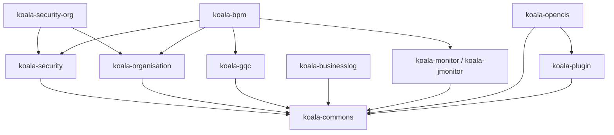

# Koala 子系统操作手册

## 1. 适用范围

本文档说明当前仓库各子系统的用途、编译方式、启动方式、端口、数据源默认策略和系统集成关系。当前根工程已经把主要顶层模块都纳入 Maven reactor。

## 2. 环境准备

必须使用 JDK 17 编译和启动当前修复后的工程。不要使用 Homebrew 默认 Java 25，BPM Core 中的 jBPM 5.4/MVEL 会访问已移除的 `java.lang.Compiler`，导致 Jetty 端口已监听但页面返回 503。

```bash
export JAVA_HOME=<JDK17_HOME>
export PATH="$JAVA_HOME/bin:$PATH"
mvn -version
mvn -DskipTests compile
```

已验证根目录全量编译通过：

```text
BUILD SUCCESS
Reactor modules: 122
Verified at: 2026-06-14 10:27:13 +08:00
```

`.mvn/settings.xml` 和 `.mvn/maven.config` 用于补充旧项目依赖解析配置。`.mvn/jvm.config` 打开 JDK 17 下旧 Spring/Groovy 反射所需的 `java.lang`、`java.util`。不要随意删除这些文件，否则老依赖或运行时反射可能再次失败。

## 3. 根 Reactor 模块

根 `pom.xml` 当前包含：

```text
koala-commons
koala-security
koala-organisation
koala-security-org
koala-bpm
koala-monitor
koala-gqc
koala-opencis
koala-businesslog
koala-plugin
```

说明：`koala-monitor` 是目录模块名，内部聚合 POM 的 `artifactId` 是 `koala-jmonitor`，所以 Maven 日志会显示 `koala-jmonitor`。

## 4. 子系统说明

| 子系统 | 作用 | 设计文档 |
| --- | --- | --- |
| `koala-commons` | 公共领域基类、Repository、异常、资源、缓存、测试支撑 | `koala-commons/DESIGN.md` |
| `koala-security` | 用户、角色、权限、资源、Shiro/Web 安全 | `koala-security/DESIGN.md` |
| `koala-organisation` | 公司、部门、岗位、职务、员工等组织模型 | `koala-organisation/DESIGN.md` |
| `koala-security-org` | 安全与组织机构融合授权 | `koala-security-org/DESIGN.md` |
| `koala-gqc` | 通用查询配置、数据源、动态条件和分页查询 | `koala-gqc/DESIGN.md` |
| `koala-businesslog` | AOP + Groovy 的业务日志记录和查询 | `koala-businesslog/DESIGN.md` |
| `koala-monitor` | 应用运行监控，构件名为 `koala-jmonitor` | `koala-monitor/DESIGN.md` |
| `koala-bpm` | jBPM 工作流、动态表单、设计器和 OSS 聚合 | `koala-bpm/DESIGN.md` |
| `koala-opencis` | SCM/CI/质量/缺陷/CAS 工具链集成 | `koala-opencis/DESIGN.md` |
| `koala-plugin` | 项目、模块、CRUD、EJB、WebService 代码生成 | `koala-plugin/DESIGN.md` |

## 5. 编译命令

全量编译：

```bash
mvn -DskipTests compile
```

编译单个可运行模块及其依赖：

```bash
mvn -pl koala-security/koala-security-web -am -DskipTests compile
mvn -pl koala-gqc/koala-gqc-web -am -DskipTests compile
mvn -pl koala-monitor/koala-jmonitor-web-mvc -am -DskipTests compile
mvn -pl koala-bpm/koala-bpm-form/koala-bpm-form-web -am -DskipTests compile
mvn -pl koala-opencis/koala-openci-platform/koala-openci-platform-web -am -DskipTests compile
```

如果要在某个聚合子工程内编译全部子模块，使用 `-f` 指定该子工程 POM，例如 `mvn -f koala-monitor/pom.xml -DskipTests compile`。在根工程里执行 `-pl koala-monitor` 只会选择聚合 POM，不会自动展开全部子模块。

当 Maven 提示 “Could not find the selected project in the reactor” 时，通常是 `-pl` 写了 artifactId 而不是模块路径。应使用路径，例如：

```bash
mvn -pl koala-businesslog/koala-businesslog-web -am jetty:run
```

## 6. Web 启动命令

常用 Web 模块：

```bash
mvn -pl koala-security/koala-security-web -am jetty:run
mvn -Djetty.port=8071 -pl koala-organisation/koala-organisation-web -am jetty:run
mvn -pl koala-security-org/koala-security-org-web -am jetty:run
mvn -pl koala-gqc/koala-gqc-web -am jetty:run
mvn -pl koala-businesslog/koala-businesslog-web -am jetty:run
mvn -Dcargo.port=7654 -pl koala-businesslog/koala-businesslog-acceptance-test jetty:run
mvn -pl koala-monitor/koala-jmonitor-web-mvc -am jetty:run
```

BPM 与 OpenCIS Web 模块启动前先固定 Maven 运行 JDK：

```bash
export JAVA_HOME=<JDK17_HOME>
export PATH="$JAVA_HOME/bin:$PATH"
mvn -version
```

确认 `mvn -version` 输出的 Java home 是上面的 JBR/JDK 17 后，再启动：

```bash
mvn -Djetty.port=8072 -pl koala-bpm/koala-bpm-form/koala-bpm-form-web -am jetty:run
mvn -Djetty.port=8073 -pl koala-bpm/koala-bpm-designer/koala-bpm-designer-web -am jetty:run
mvn -Djetty.port=8074 -pl koala-bpm/koala-bpm-core/koala-bpm-core-war -am jetty:run
mvn -Djetty.port=8075 -pl koala-bpm/koala-bpm-oss/koala-bpm-oss-web -am jetty:run
mvn -Djetty.port=8076 -pl koala-opencis/koala-openci-platform/koala-openci-platform-web -am jetty:run
mvn -Dtomcat.port=8077 -pl koala-opencis/koala-cas-management/koala-cas-management-web -am org.apache.tomcat.maven:tomcat7-maven-plugin:2.1:run
```

CAS Management 使用 Tomcat 7 Maven 插件时，老 Maven 前缀 `tomcat7:run` 可能解析不到插件；直接使用完整插件坐标更稳定。也可以对单条命令显式指定 JDK 17：

```bash
JAVA_HOME=<JDK17_HOME> \
mvn -Dtomcat.port=8077 -pl koala-opencis/koala-cas-management/koala-cas-management-web -am org.apache.tomcat.maven:tomcat7-maven-plugin:2.1:run
```

建议本地验证端口：

| 模块 | 默认端口/上下文 |
| --- | --- |
| `koala-security-web` | `http://localhost:8070/` |
| `koala-organisation-web` | `http://localhost:8071/` |
| `koala-security-org-web` | `http://localhost:8090/` |
| `koala-gqc-web` | `http://localhost:7652/` |
| `koala-jmonitor-web-mvc` | `http://localhost:7653/` |
| `koala-bpm-form-web` | `http://localhost:8072/` |
| `koala-bpm-designer-web` | `http://localhost:8073/` |
| `koala-bpm-core-war` | `http://localhost:8074/` |
| `koala-bpm-oss-web` | `http://localhost:8075/` |
| `koala-openci-platform-web` | `http://localhost:8076/openci-platform/` |
| `koala-cas-management-web` | `http://localhost:8077/` |

未固定端口的 Jetty 模块默认使用 8080。多个 Web 同时运行时必须改端口；当前 8080 上已有进程时，建议统一使用上面的 8071-8077 临时端口。

当前已验证的启动结果：

| 模块 | 验证命令/端口 | 结果 |
| --- | --- | --- |
| `koala-security-web` | `8070` | `/` 和 `/auth/user/pagingQuery.koala` 返回 `302` 登录跳转 |
| `koala-security-org-web` | `8090` | `/job/pagingquery.koala` 返回 `302` 登录跳转，不再返回 `500` |
| `koala-organisation-web` | `8071` | `/` 返回 `200`，`/job/pagingquery.koala?page=0&pagesize=10` 返回 `200` |
| `koala-businesslog-web` | `7651` | `/` 和 `/index.html` 返回 `200` |
| `koala-businesslog-acceptance-test` | `7654` | `/`、`/login.html`、`/pages/businesslog/index.jsp` 返回 `200` |
| `koala-gqc-web` | `7652` | 现有实例 `/` 返回 `200` |
| `koala-jmonitor-web-mvc` | `7653` | 现有实例 `/` 返回 `200` |
| `koala-bpm-form-web` | `8072` | `/`、`/processform/list.koala`、`/processform/getDataList.koala?page=0&pagesize=10` 返回 `200` |
| `koala-bpm-designer-web` | `8073` | `/` 返回 `200` |
| `koala-bpm-core-war` | `8074` | JDK 17 下 `/` 和 `/ws/` 返回 `200`；`/ws/jbpmService/processes` 返回无服务 `404` |
| `koala-bpm-oss-web` | `8075` | `/`、`/processform/list.koala`、`/processform/getDataList.koala?page=0&pagesize=10` 返回 `200` |
| `koala-openci-platform-web` | `8076` | `/openci-platform/` 和 `/openci-platform/project/pagingquery?page=0&pagesize=10` 返回 `200` |
| `koala-cas-management-web` | `8077` | `/`、`/login.koala`、`/index.koala` 返回 `200`，`/api/user/test` 返回无资源 `404` |

`koala-bpm-form-web` 单独运行时，如果没有 `JBPMApplication` Bean，流程下拉为空并记录 WARN；这不影响表单管理页面启动。完整 BPM 联调时需同时接入 BPM Core 服务。

`koala-bpm-core-war` 已导入 CXF bus，`/ws/` 可显示 CXF 服务页。由于当前工程使用 Spring `4.3.30.RELEASE`，而 CXF `2.6.2` 的 JAX-RS Spring 集成会调用已移除的旧 Spring AOP API，`cxf-rest.xml` 暂不创建 `jaxrs:server`；如需恢复 `/ws/jbpmService/*`，应先升级 CXF 到兼容 Spring 4 的版本。

`koala-businesslog-acceptance-test` 是业务日志验收示例 WAR，不适合作为业务日志管理后台替代品。该模块使用 Jetty 9，端口参数使用 `-Dcargo.port=7654`；不要带 `-am` 执行 `jetty:run`，否则 Maven 会尝试对父 POM 运行 Jetty 并占用 8080。

## 7. 数据源策略

当前本地启动优先使用 H2，便于老项目直接运行：

- Security、Security-Org、Organisation、GQC、BusinessLog、Monitor 已按本地 H2 启动方向做过兼容。
- BusinessLog 验收示例也使用本地 H2，并在启动时初始化组织机构演示数据和业务日志表。
- Monitor Web 使用 `koala-monitor/koala-jmonitor-applicationImpl/src/main/resources/META-INF/sql` 初始化监控表。
- GQC 默认增加了 2 个数据源初始化入口，用于页面直接测试通用查询。
- BPM 和 OpenCI Platform 已按本地 H2 启动方向做过兼容；完整业务联调前仍需要确认流程引擎、SCM、Jenkins 等外部工具地址。
- CAS Management 默认使用 H2 内存库 `jdbc:h2:mem:cas_user_manage;DB_CLOSE_DELAY=-1`。如需连接历史 MySQL，可启用 `mysql` profile。

## 8. 系统融合关系

系统之间的融合关系如下：



融合原则：

- `koala-commons` 是底座，不依赖业务子系统。
- `koala-security` 管账号、角色、资源；`koala-organisation` 管组织结构。
- `koala-security-org` 把安全 Actor 和组织 Employee/Department 打通。
- `koala-gqc` 可嵌入其他 Web，提供配置式查询页面。
- `koala-businesslog` 可嵌入任意业务模块，通过 AOP 记录业务操作。
- `koala-monitor` 可作为独立监控控制台，也可由业务应用引入 core 采集运行轨迹。
- `koala-bpm` 是上层业务流程编排，会引用安全、组织、GQC 和监控能力。
- `koala-opencis` 面向研发工具链，并引用 `koala-plugin-create` 生成项目骨架。

## 9. 已知兼容性边界

- 工程源码仍按 Java 6 风格维护；当前只是让它能在 JDK 17 下编译。
- BPM 中旧 Spring Security 3 控制器已排除编译，权限闭环需迁移到当前安全模块。
- BPM Core 的 CXF JAX-RS 服务端点暂未启用，原因是 CXF `2.6.2` 与 Spring `4.3.30.RELEASE` 不兼容；当前保留 `/ws/` 服务页以保证应用可启动。
- OpenCIS 的 Jenkins 客户端当前为占位适配，真实 Jenkins Job 操作需接入新的 Jenkins API。
- CAS 管理中依赖旧 `ss3Adapter` 安全链的控制器和用户服务已排除编译；本地只保留页面入口和空 JAX-RS Application，完整登录、授权和用户 API 需继续迁移。
- 老 POM 仍有重复依赖、缺少插件版本等 Maven warning，不影响当前编译，但后续应逐步清理。

## 10. 排障

模块选择错误：

```text
Could not find the selected project in the reactor
```

使用模块路径，不要只写 artifactId。例如 `koala-monitor/koala-jmonitor-web-mvc`，不要写 `koala-jmonitor-web-mvc`。

端口占用：

```bash
lsof -i :7653
```

换端口启动时优先使用插件参数，例如 `-Djetty.port=8072` 或 `-Dtomcat.port=8077`。

BPM Core 使用 Java 25 启动失败：

```text
NoClassDefFoundError: java/lang/Compiler
```

原因是 jBPM 5.4/MVEL 依赖 JDK 17 仍保留、Java 25 已移除的旧 API。处理方式是先停止旧进程，执行第 2 节的 `JAVA_HOME` 和 `PATH` 设置，再重新运行 BPM 启动命令。

BPM 四个 Web 模块的 Jetty 插件已通过 `webInfIncludeJarPattern` 跳过 `WEB-INF/lib` 注解扫描，避免 Jetty 8 扫描 multi-release JAR 时输出 `Problem processing jar entry META-INF/versions/9/...` 堆栈。如果其他旧 Web 模块仍出现类似日志，先以 HTTP 返回码判断是否真正启动失败。

依赖解析失败：

```bash
mvn -U -DskipTests compile
```

如果删除过 `.mvn/settings.xml` 或 `.mvn/maven.config`，先恢复这些配置。
