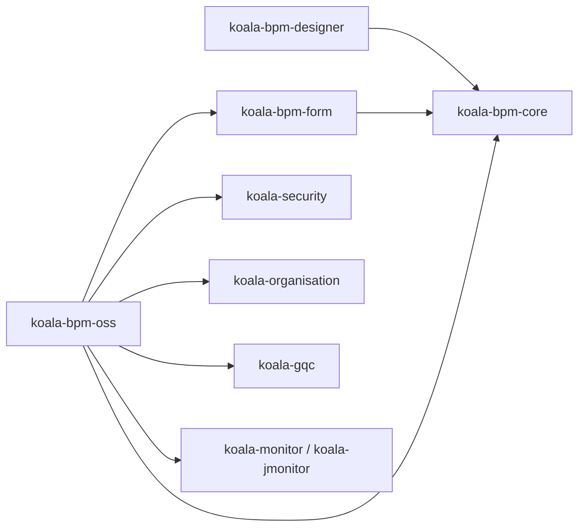
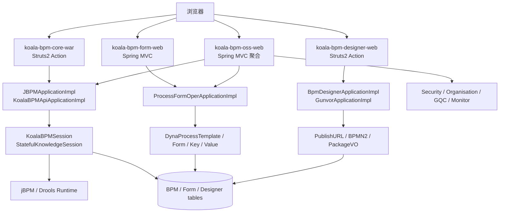
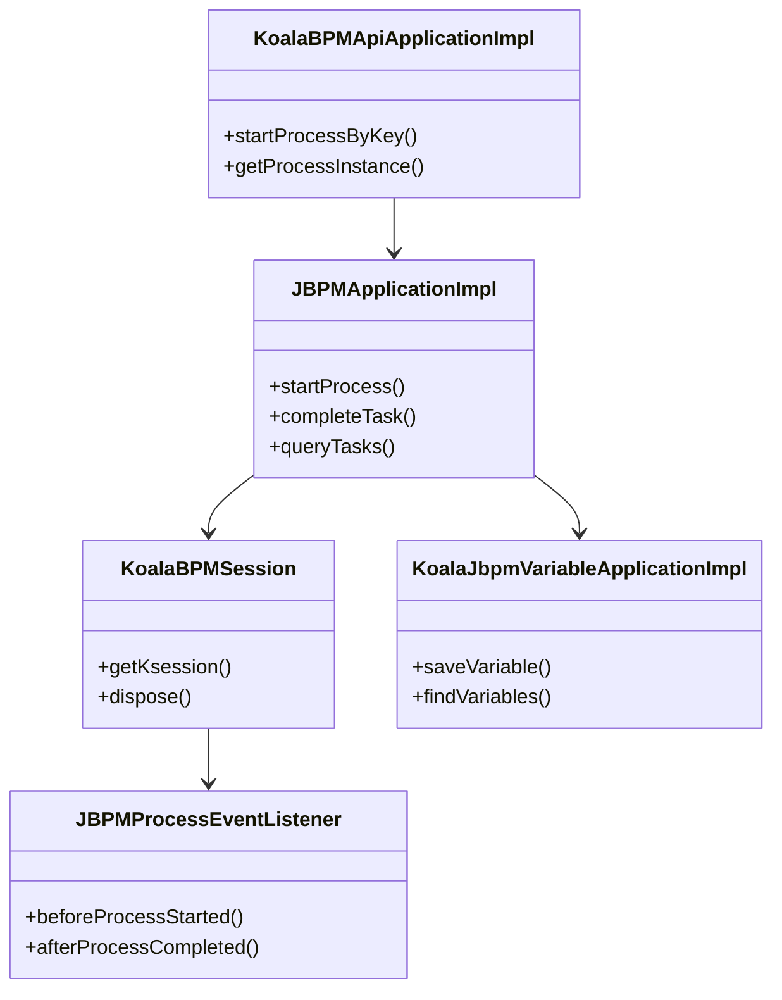
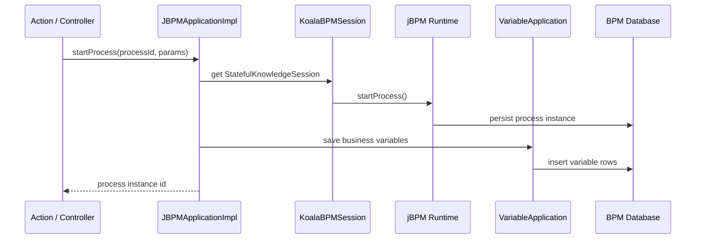
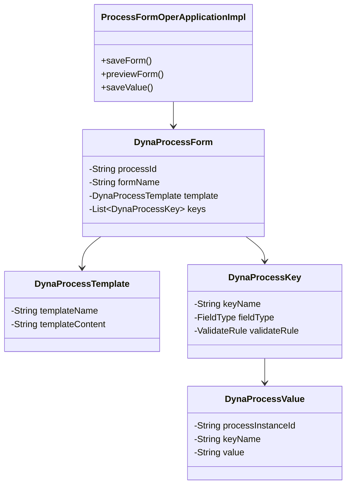
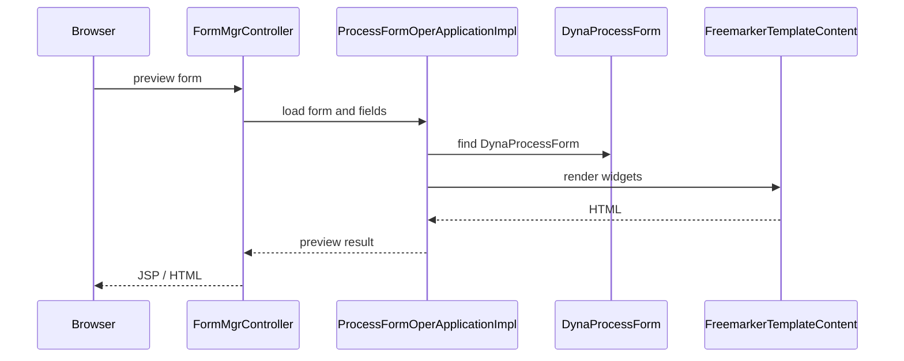

# koala-bpm 设计文档

## 1. 文档范围

本文档说明 `koala-bpm` 工作流子系统的模块边界、架构设计、核心领域模型、运行流程、Mermaid UML、启动方式和当前兼容性改造说明。BPM 模块由 jBPM 运行时、流程设计器、动态表单和 OSS 聚合控制台组成。

## 2. 模块定位

`koala-bpm` 负责 Koala 平台中的流程建模、流程发布、任务办理、动态表单和业务支撑能力：

- 基于 jBPM/Drools 管理流程定义、流程实例、任务和变量。
- 通过设计器模块维护 BPMN2、流程包和发布地址。
- 通过动态表单模块配置流程表单模板、字段和值。
- 通过 OSS Web 聚合流程表单、组织机构、权限和监控入口。

## 3. 工程结构

```text
koala-bpm/
├── koala-bpm-core/       # jBPM 运行时、流程服务、WS/REST 适配、Struts Web
├── koala-bpm-designer/   # 流程设计器、BPMN2/JSON 转换、发布地址维护
├── koala-bpm-form/       # 动态流程表单、字段、模板、FreeMarker 渲染
├── koala-bpm-oss/        # 聚合控制台，整合 BPM Form、Organisation、GQC、Monitor
└── pom.xml               # Maven 聚合工程
```

主要子模块：



## 4. 总体架构

BPM 采用“运行时核心 + 表单扩展 + 设计器 + 聚合 Web”的结构：

1. `koala-bpm-core` 封装 jBPM session、流程发布、任务查询、变量管理和对外适配接口。
2. `koala-bpm-designer` 管理流程包、BPMN2 和发布 URL，并通过应用服务调用核心运行时。
3. `koala-bpm-form` 维护动态表单元数据，使用 FreeMarker 将字段定义渲染为页面。
4. `koala-bpm-oss` 把流程、组织、权限、GQC 和监控页面聚合到一个 Web 应用中。



## 5. 核心运行时设计

`koala-bpm-core` 是流程运行时核心：

- `koala-bpm-core-infra`：jBPM、Drools、持久化和基础设施依赖。
- `koala-bpm-core-bizmodel`：流程相关领域对象。
- `koala-bpm-core-application`：应用服务接口。
- `koala-bpm-core-applicationImpl`：`JBPMApplicationImpl`、`KoalaBPMApiApplicationImpl`、变量、分配和发布服务实现。
- `koala-bpm-core-adapterApplication*`：SOAP/REST 适配客户端。
- `koala-bpm-core-war`：旧 Struts2 Web 入口。

核心类关系：



启动流程实例的典型链路：



## 6. 动态表单设计

`koala-bpm-form` 负责流程表单定义和数据保存：

- `DynaProcessTemplate`：表单模板，包含模板名称和模板内容。
- `DynaProcessForm`：流程表单定义，关联流程和表单模板。
- `DynaProcessKey`：动态字段定义，包含字段类型、校验规则、显示属性。
- `DynaProcessValue`：流程实例运行时字段值。
- `DynaProcessHistoryValue`：历史字段值。
- `FreemarkerTemplateContent`：将字段定义渲染成 HTML。



表单预览流程：



## 7. 设计器与 OSS 聚合

设计器模块使用 `BpmDesignerApplicationImpl` 和 `GunvorApplicationImpl` 管理流程包、BPMN2 内容和发布地址。Web 层以 Struts2 Action 为入口，页面资源位于 `koala-bpm-designer-web/src/main/webapp/pages/jbpm`。

OSS 聚合模块提供统一控制台，核心 Web 控制器包括：

- `BusinessSupportController`：业务流程支撑。
- `FormMgrController`：动态表单维护。
- 组织机构、监控、权限相关控制器：当前编译阶段对旧安全包强绑定的重复控制器做了排除，实际使用时建议跳转到独立子系统。

## 8. 当前兼容性改造

为了让当前工程在现代本地环境可编译，已做如下处理：

- 为 JDK 17 缺失的 JAXB API 添加显式依赖。
- 将旧 `3.0.0-SNAPSHOT` 安全依赖替换为当前 reactor 中的 `4.0.0` 模块。
- 排除旧 Spring Security 3 时代的嵌入式 auth/organisation/monitor 控制器，避免依赖已经不存在的包。
- `BusinessSupportController` 对登录用户使用 `admin` 兜底，便于本地无登录上下文时启动。
- `DynaProcessForm` 清理历史冲突标记，并保留 `@Transient` 的模板内容访问方式。

这些改造保证编译通过；如果要恢复完整 BPM 权限闭环，应把旧控制器迁移到当前 `koala-security` / `koala-security-org` 的 Facade。

## 9. 构建与启动

从根目录编译 BPM：

```bash
mvn -pl koala-bpm -am -DskipTests compile
```

可尝试启动的 Web 模块：

```bash
mvn -pl koala-bpm/koala-bpm-form/koala-bpm-form-web -am jetty:run
mvn -pl koala-bpm/koala-bpm-designer/koala-bpm-designer-web -am jetty:run
mvn -pl koala-bpm/koala-bpm-core/koala-bpm-core-war -am jetty:run
mvn -pl koala-bpm/koala-bpm-oss/koala-bpm-oss-web -am jetty:run
```

多个 Web 模块同时启动时需要调整端口，避免 Jetty 默认端口冲突。

## 10. 扩展建议

- 新增流程能力优先放在 `koala-bpm-core-application` 和 `applicationImpl`，Web 层只做参数转换。
- 表单字段新增时同时补充 `FieldType`、FreeMarker widget 模板和 `DynaProcessKey` 解析逻辑。
- OSS 聚合层不要复制其他子系统控制器，推荐通过 Facade 或独立链接整合。
- jBPM 版本较旧，升级会影响 Drools、持久化表和任务服务，需要单独迁移方案。
