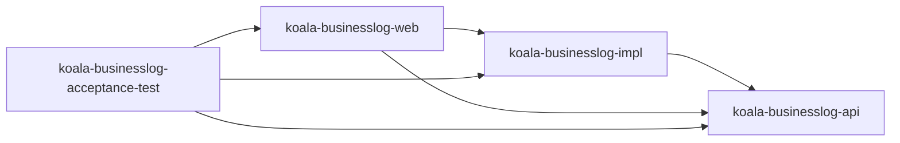
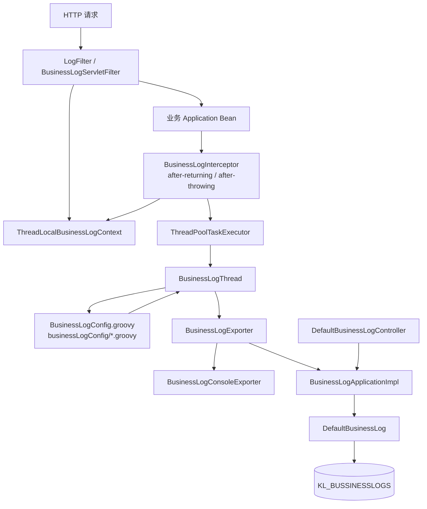
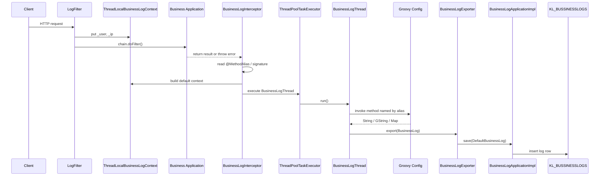

# koala-businesslog 设计文档

## 1. 文档范围

本文档说明 `koala-businesslog` 业务日志子系统的模块边界、运行架构、核心流程、UML 关系、配置方式、持久化模型和扩展点。该模块的目标是在尽量少侵入业务代码的前提下，通过 Spring AOP 和 Groovy 日志模板记录用户业务操作。

## 2. 模块定位

`koala-businesslog` 是一个可嵌入业务系统的日志组件，关注“业务动作发生了什么”，而不是技术审计日志或访问日志。

核心能力包括：

- 通过 `@MethodAlias` 或方法签名定位被记录的业务方法。
- 通过 `koala-businesslog.properties` 配置 AOP 切点、日志开关、导出器和线程池。
- 通过 `BusinessLogConfig.groovy` 或 `businessLogConfig/*.groovy` 将方法上下文渲染成日志文本。
- 通过 `BusinessLogExporter` 扩展日志输出方式，默认支持控制台输出和数据库落库。
- 通过 Web 模块提供日志分页查询、详情和删除接口。

## 3. 工程结构

```text
koala-businesslog/
├── koala-businesslog-api/              # 对外 API：日志对象、导出器接口、方法别名注解、上下文 key
├── koala-businesslog-impl/             # 核心实现：AOP 拦截、Groovy 模板、异步处理、领域模型、持久化配置
├── koala-businesslog-web/              # Web 管理端：日志查询 Controller、Filter、Spring MVC 配置、页面资源
├── koala-businesslog-acceptance-test/  # 验收示例：组织机构业务示例、Groovy 模板和集成测试
├── README.md                           # 使用说明
└── pom.xml                             # Maven 聚合工程
```

模块依赖方向：



## 4. 总体架构

业务日志子系统由五层组成：

1. 接入层：`LogFilter` 收集用户和 IP，Spring AOP 根据 `pointcut` 拦截业务方法。
2. 上下文层：`ThreadLocalBusinessLogContext` 保存请求线程中的用户、IP、方法参数、返回值和异常。
3. 日志生成层：`BusinessLogThread` 加载 Groovy 配置，调用与业务方法别名同名的模板方法。
4. 导出层：`BusinessLogExporter` 将 `BusinessLog` 输出到控制台、数据库或自定义目标。
5. 查询层：`BusinessLogApplicationImpl` 和 `DefaultBusinessLogController` 提供日志查询和管理能力。



## 5. 核心运行流程

### 5.1 请求上下文采集

`BusinessLogServletFilter` 是抽象 Filter，子类在 `beforeFilter()` 中放入日志上下文。默认实现 `LogFilter` 会写入：

- `_user`：来自请求参数 `user`。
- `_ip`：来自 `ServletRequest#getRemoteAddr()`。

当前 Filter 在请求结束后没有调用 `ThreadLocalBusinessLogContext.clear()`，在容器线程复用场景下需要关注上下文残留风险。接入业务系统时建议在自定义 Filter 中使用 `try/finally` 清理上下文。

### 5.2 AOP 拦截业务方法

`koala-businesslog-aop.xml` 定义核心 Bean：

- `logInterceptor`：业务日志拦截器。
- `businessLogExporter`：由 `${businessLogExporter}` 指定的导出器实现。
- `threadPoolTaskExecutor`：异步日志线程池。
- `businessBehavior`：由 `${pointcut}` 指定的 Spring AOP 切点。

拦截器在业务方法成功返回后调用 `logAfter()`，在业务方法抛出异常后调用 `afterThrowing()`。日志开关读取 `koala-businesslog.properties` 中的 `kaola.businesslog.enable`，注意属性名前缀是代码中的历史拼写 `kaola`。

### 5.3 方法别名解析

`BusinessLogInterceptor#getBLMapping()` 优先读取业务方法上的 `@MethodAlias`：

```java
@MethodAlias("OrganizationApplicationImpl_createCompany")
public Organization createCompany(Organization parent, Organization child) {
    ...
}
```

如果没有注解，则使用 `joinPoint.getSignature().toString()` 作为模板方法名。实际项目建议显式使用 `@MethodAlias`，否则方法签名包含空格、包名或参数类型时不适合作为 Groovy 方法名。

### 5.4 默认上下文内容

拦截器会向上下文补充以下 key：

| Key | 含义 |
| --- | --- |
| `_param0`, `_param1` | 业务方法参数，按下标编号 |
| `_methodReturn` | 业务方法返回值 |
| `_executeError` | 业务方法异常原因 |
| `_businessMethod` | 方法别名或方法签名 |
| `_user` | 操作人 |
| `_time` | 操作时间 |
| `_ip` | 请求 IP |

### 5.5 Groovy 模板生成日志

日志模板有两种布局：

- 单文件：`classpath:/BusinessLogConfig.groovy`
- 多文件目录：`classpath:/businessLogConfig/*.groovy`

单文件配置优先级更高。存在 `BusinessLogConfig.groovy` 时，系统只加载单文件配置；否则扫描 `businessLogConfig` 目录，寻找包含目标方法名的 Groovy 类。

模板方法返回值支持两类：

```groovy
def OrganizationApplicationImpl_createCompany() {
    "${context._user}: 创建分公司 ${context._param1.name}"
}
```

```groovy
def OrganizationApplicationImpl_createCompany() {
    [
        category: "组织机构",
        log: "${context._user}: 创建分公司 ${context._param1.name}"
    ]
}
```

返回 `String` 或 `GString` 时只设置日志内容；返回 `LinkedHashMap` 时读取 `category` 和 `log`。

## 6. 时序图



## 7. UML 类图

```mermaid
classDiagram
    direction LR

    class MethodAlias {
        <<annotation>>
        +value() String
    }

    class ContextKeyConstant {
        <<interface>>
        BUSINESS_METHOD_RETURN_VALUE_KEY
        PRE_OPERATOR_OF_METHOD_KEY
        BUSINESS_METHOD_EXECUTE_ERROR
        BUSINESS_METHOD
        BUSINESS_OPERATION_USER
        BUSINESS_OPERATION_TIME
        BUSINESS_OPERATION_IP
    }

    class BusinessLog {
        -String log
        -String category
        -Map context
        +addContext(Map)
        +getContext() Map
    }

    class BusinessLogExporter {
        <<interface>>
        +export(BusinessLog)
    }

    class BusinessLogConsoleExporter {
        +export(BusinessLog)
    }

    class BusinessLogExporterImpl {
        -BusinessLogApplication businessLogApplication
        +export(BusinessLog)
    }

    class BusinessLogInterceptor {
        -ThreadPoolTaskExecutor threadPoolTaskExecutor
        -BusinessLogExporter businessLogExporter
        +logAfter(JoinPoint, Object)
        +afterThrowing(JoinPoint, Throwable)
        +log(JoinPoint, Object, Throwable)
    }

    class BusinessLogThread {
        -Map context
        -String BLMappingValue
        -BusinessLogExporter businessLogExporter
        +run()
    }

    class GroovyObjectClassCache {
        -Class standaloneGroovyObjectClass
        -Set~Class~ groovyObjectClasses
        +getStandaloneGroovyObjectClass() Class
        +getGroovyObjectClasses() Set
    }

    class ThreadLocalBusinessLogContext {
        -ThreadLocal~Map~ context
        +get() Map
        +put(String, Object)
        +clear()
        +putBusinessLogMethod(String)
    }

    class BusinessLogApplication {
        <<interface>>
        +save(DefaultBusinessLog)
        +pageQueryDefaultBusinessLog(DefaultBusinessLogDTO, int, int) Page
        +removeDefaultBusinessLogs(Long[])
    }

    class BusinessLogApplicationImpl {
        -QueryChannelService queryChannel
        +save(DefaultBusinessLog)
        +pageQueryDefaultBusinessLog(DefaultBusinessLogDTO, int, int) Page
    }

    class AbstractBusinessLog {
        <<mapped superclass>>
        -Long id
        -int version
        -String category
        -String log
        +save()
        +remove()
        +findAll(Class) List
    }

    class DefaultBusinessLog {
        <<entity>>
        -String user
        -String ip
        -Date time
        +createBy(BusinessLog) DefaultBusinessLog
    }

    class DefaultBusinessLogDTO {
        -Long id
        -String category
        -Date time
        -Date timeEnd
        -String log
        -String user
        -String ip
    }

    BusinessLogExporter <|.. BusinessLogConsoleExporter
    BusinessLogExporter <|.. BusinessLogExporterImpl
    BusinessLogApplication <|.. BusinessLogApplicationImpl
    AbstractBusinessLog <|-- DefaultBusinessLog

    BusinessLogInterceptor --> ThreadLocalBusinessLogContext
    BusinessLogInterceptor --> BusinessLogThread
    BusinessLogInterceptor --> BusinessLogExporter
    BusinessLogThread --> GroovyObjectClassCache
    BusinessLogThread --> BusinessLog
    BusinessLogThread --> BusinessLogExporter
    BusinessLogExporterImpl --> BusinessLogApplication
    BusinessLogApplicationImpl --> DefaultBusinessLog
    DefaultBusinessLog ..> BusinessLog
    DefaultBusinessLogDTO ..> DefaultBusinessLog
    BusinessLogInterceptor ..> MethodAlias
    BusinessLogInterceptor ..> ContextKeyConstant
```



## 8. 数据模型与持久化

默认落库实体是 `DefaultBusinessLog`，表名为 `KL_BUSSINESSLOGS`，注意表名中的 `BUSSINESS` 是当前代码里的历史拼写。

| 字段 | 列名 | 说明 |
| --- | --- | --- |
| `id` | `ID` | 主键，`GenerationType.AUTO` |
| `version` | `VERSION` | 乐观锁版本 |
| `category` | `LOG_CATEGORY` | 日志分类 |
| `log` | `LOG_CONTENT` | 日志内容 |
| `user` | `USERNAME` | 操作人 |
| `ip` | `IP` | 请求 IP |
| `time` | `RECORD_TIME` | 操作时间 |

持久化配置分三种：

- `koala-businesslog-standalone-persistence.xml`：日志模块独立数据源，创建 `entityManagerFactory_businessLog`、`transactionManager_businessLog`、`repository_businessLog` 和 `queryChannel_businessLog`。
- `koala-businesslog-shared-persistence.xml`：复用业务系统 `persistenceUnitName=default` 和 `entityManagerFactory`。
- `koala-businesslog-mybatis-shared-persistence.xml`：复用 `persistenceUnitName=jpadefault` 和 `entityManagerFactoryJPA`，用于混合持久化环境。

领域模型采用 Active Record 风格：`AbstractBusinessLog` 通过静态 `repository_businessLog` 提供 `save()`、`remove()`、`load()`、`findAll()` 等方法。应用服务 `BusinessLogApplicationImpl` 在事务边界内调用这些领域方法。

## 9. Web 查询接口

`koala-businesslog-web` 提供 `DefaultBusinessLogController`，基础路径为 `/log`。

| 接口 | 方法 | 说明 |
| --- | --- | --- |
| `/log/list?page=1&pagesize=20` | GET/POST | 按用户、IP、时间、分类、日志内容分页查询 |
| `/log/get/{id}` | GET/POST | 查询单条日志详情 |
| `/log/delete?ids=1,2,3` | GET/POST | 批量删除日志 |

Spring MVC 配置文件名是 `META-INF/spring/koala-busniesslog-servlet.xml`，文件名中的 `busniesslog` 是历史拼写。该配置扫描 `org.openkoala.businesslog.web` 下的 Controller，并使用 Jackson message converter 输出 JSON。

## 10. 配置说明

典型配置文件为 `koala-businesslog.properties`：

```properties
pointcut=execution(* org.openkoala.organisation.application.impl.*.*(..))
kaola.businesslog.enable=true
businessLogExporter=org.openkoala.businesslog.utils.BusinessLogExporterImpl

log.threadPool.corePoolSize=10
log.threadPool.maxPoolSize=50
log.threadPool.queueCapacity=1000
log.threadPool.keepAliveSeconds=300
log.threadPool.rejectedExecutionHandler=java.util.concurrent.ThreadPoolExecutor$CallerRunsPolicy
```

关键配置项：

- `pointcut`：Spring AOP 切点，只能拦截 Spring 容器管理的 Bean。
- `kaola.businesslog.enable`：日志开关，默认按代码读取为 `true`。
- `businessLogExporter`：导出器实现类，默认可选 `BusinessLogExporterImpl` 或 `BusinessLogConsoleExporter`。
- `log.threadPool.*`：异步执行参数，拒绝策略默认可使用 `CallerRunsPolicy` 回退到调用线程执行。
- `log.db.*`：使用默认数据库导出器时需要配置日志数据源。

## 11. 构建、测试与本地运行

当前项目依赖较老，建议使用 JDK 17 运行，不要使用默认的 JDK 25：

```bash
export JAVA_HOME=<JDK17_HOME>
export PATH="$JAVA_HOME/bin:$PATH"
```

在仓库根目录常用 Maven 命令：

```bash
mvn -pl koala-businesslog/koala-businesslog-web -am -DskipTests install
mvn -pl koala-businesslog/koala-businesslog-impl -am test
```

启动 Web 模块时不要和 `-am` 混用，先安装依赖模块，再只对 Web 模块执行 Jetty：

```bash
cd koala-businesslog/koala-businesslog-web
mvn jetty:run
```

说明：

- `-am` 会同时构建依赖模块。
- `jetty:run` 不建议加 `-am`，否则 Maven 会尝试在父 POM 和依赖模块上执行 Jetty 目标。
- 本地启动地址为 `http://127.0.0.1:7651/`。
- 单元测试主要位于 `koala-businesslog-impl/src/test/java`，命名为 `*Test.java`。
- 验收示例位于 `koala-businesslog-acceptance-test`，包含组织机构业务样例、Groovy 模板和 `MainIntegrationTest`。
- Web 模块 Jetty 插件默认端口来自 `${cargo.port}`，父 POM 当前设置为 `7651`。

## 12. 扩展点

### 12.1 自定义日志导出器

实现 `BusinessLogExporter` 并在 `koala-businesslog.properties` 中配置：

```java
public class KafkaBusinessLogExporter implements BusinessLogExporter {
    public void export(BusinessLog businessLog) {
        // send to Kafka
    }
}
```

```properties
businessLogExporter=com.example.KafkaBusinessLogExporter
```

### 12.2 自定义上下文采集

继承 `BusinessLogServletFilter`，在 `beforeFilter()` 中写入用户、租户、请求来源等信息。自定义 key 可以直接通过 `ThreadLocalBusinessLogContext.put(key, value)` 写入，然后在 Groovy 模板中使用。

### 12.3 自定义日志模板

推荐为每个业务方法声明稳定的 `@MethodAlias`，并在 Groovy 类中使用同名方法。模板只负责描述日志内容，不建议在模板内执行复杂业务查询，避免异步日志线程反向影响业务系统。

## 13. 设计注意事项

- 该模块依赖 Spring AOP，只能拦截 Spring 容器管理的业务 Bean。
- `BusinessLogInterceptor` 通过反射读取 Spring AOP 的 `MethodInvocationProceedingJoinPoint.methodInvocation` 私有字段，升级 Spring 版本时需要重点回归。
- 日志生成默认异步执行，业务方法完成后日志才会渲染和导出；如果日志必须强一致，需要替换线程池或导出策略。
- 如果 Groovy 模板方法不存在，`BusinessLogThread` 会直接返回，不会写入日志。
- 如果模板返回类型不是 `String`、`GString` 或包含 `category/log` 的 `LinkedHashMap`，会抛出 `BusinessLogBaseException`。
- 默认 Filter 没有清理 ThreadLocal，生产接入建议在请求结束时调用 `ThreadLocalBusinessLogContext.clear()`。
- 默认落库表名、配置文件名和开关 key 存在历史拼写，改名会影响兼容性，应通过迁移方案处理。
