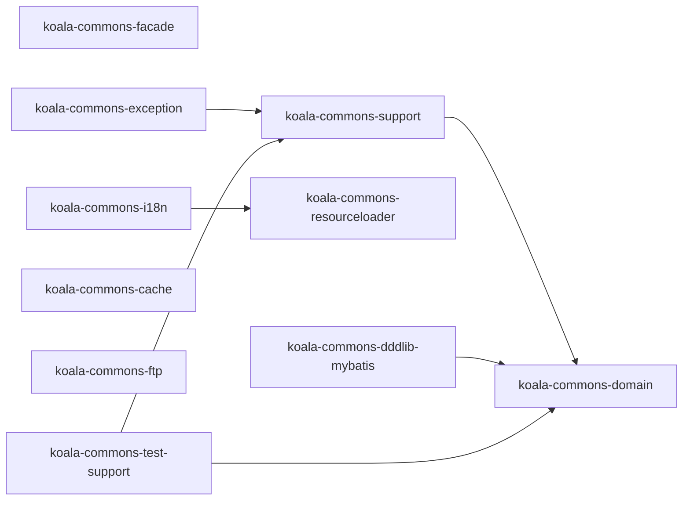
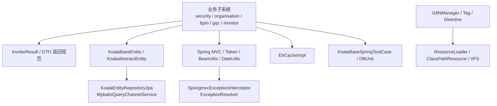
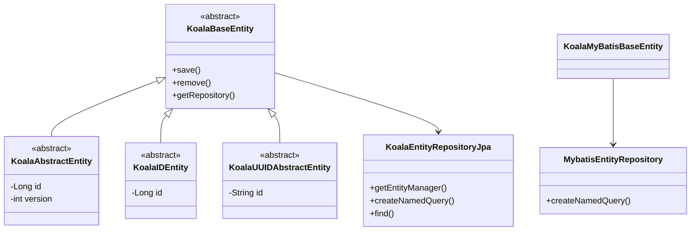
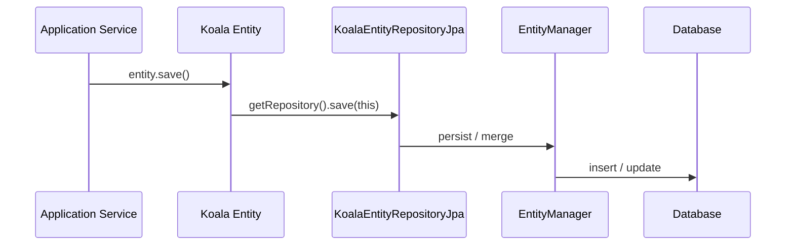
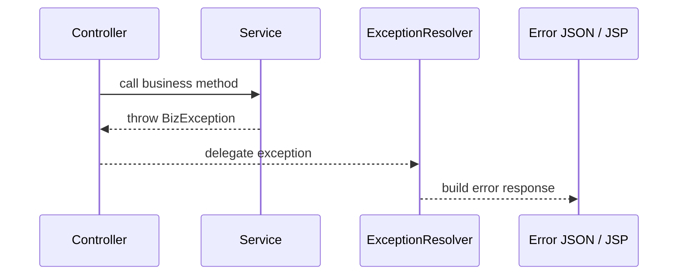

# koala-commons 设计文档

## 1. 文档范围

本文档说明 `koala-commons` 公共基础库的模块边界、分层职责、关键组件、UML 关系、使用方式和维护注意事项。该模块不提供独立 Web 入口，而是作为其他子系统的共享基础设施。

## 2. 模块定位

`koala-commons` 为 Koala 各业务模块提供横向能力：

- 统一领域实体基类和 Repository 封装。
- Spring MVC、JPA、MyBatis、DBUnit 等基础集成。
- 异常处理、国际化、资源加载、缓存、FTP 和 Token 防重复提交。
- Facade 统一返回对象 `InvokeResult`。
- 测试基类和测试数据源支持。

## 3. 工程结构

```text
koala-commons/
├── koala-commons-domain/          # 领域实体基类、JPA/MyBatis Repository
├── koala-commons-support/         # Spring MVC、BeanUtils、日期、Token、EntityManagerFactory
├── koala-commons-facade/          # InvokeResult 等 Facade 通用对象
├── koala-commons-exception/       # 业务/系统异常、Spring MVC/Struts2/AOP 异常处理
├── koala-commons-i18n/            # 国际化服务、JSP/Freemarker/Velocity 标签
├── koala-commons-resourceloader/  # 类路径、文件、VFS 资源抽象
├── koala-commons-cache/           # Ehcache 适配
├── koala-commons-dddlib-mybatis/  # MyBatis QueryChannel 与 Repository 适配
├── koala-commons-ftp/             # FTP/ZIP 工具
├── koala-commons-test-support/    # Spring、DBUnit、JDBC 属性测试基类
└── pom.xml                        # Maven 聚合工程
```

模块依赖方向：



## 4. 总体架构

`koala-commons` 位于所有业务子系统下方，提供基础类型和运行时适配。业务模块通常只依赖其中一部分能力，例如 `koala-security` 使用领域实体基类、JPA 支持和测试基类；`koala-businesslog` 使用资源加载器和通用持久化支持；`koala-plugin` 使用 XML、Velocity 和文件处理工具。



## 5. 核心组件

### 5.1 领域实体与 Repository

`koala-commons-domain` 定义多套实体基类：

- `KoalaBaseEntity`、`KoalaAbstractEntity`：面向 DDDLib/JPA 的通用实体能力。
- `KoalaIDEntity`、`KoalaUUIDAbstractEntity`：提供不同 ID 策略。
- `KoalaLegacyEntity`：兼容历史数据库模型。
- `KoalaEntityRepositoryJpa`：封装 DDDLib `EntityRepository`，并适配旧项目在 JDK 17 下的运行问题。
- `KoalaMyBatisBaseEntity`、`MybatisEntityRepository`：为 MyBatis 模块提供同风格访问入口。



### 5.2 Web 与支撑工具

`koala-commons-support` 主要承载 Web 层通用能力：

- `JsonDateSerializer`、`JsonTimestampSerializer`：统一 JSON 日期输出。
- `DataBindingInitializer`：Spring MVC 数据绑定初始化。
- `KoalaBeanUtils`、`KoalaDateUtils`：常用对象和日期工具。
- `KoalaTokenGenerateServlet`、`KoalaTokenValidateFilter`、`KoalaTokenTag`：防重复提交 Token 机制。
- `KoalaEntityManagerFactoryBean`：修复旧项目在新 JDK 下创建 JPA 工厂的兼容问题。

### 5.3 异常与国际化

异常体系分为基础异常和扩展异常：

- `BaseException`：基础异常类型。
- `BizException`、`ApplicationException`、`SystemException`、`KoalaException`：业务、应用、系统分层异常。
- `SpringmvcExceptionInterceptor`、`ExceptionResolver`：Web 异常转换。
- `AppExceptionInterceptor`：AOP 层异常拦截。
- `Struts2ExceptionInterceptor` 和标签库：兼容旧 Struts2 Web 模块。

国际化模块通过 `I18NManager` 和 `ResourceBundleI18nServiceImpl` 读取资源文件，并提供 JSP Tag、Freemarker Directive、Velocity Directive 三种模板接入方式。

### 5.4 资源加载与缓存

资源加载器提供类似 Spring `Resource` 的抽象，支持 classpath、文件系统和 VFS 场景。缓存模块当前是 `EhCacheImpl` 对 Ehcache 的轻量封装，默认配置位于 `ehcache.xml`。

## 6. 典型调用链

业务应用保存实体时，调用链通常如下：



异常处理调用链：



## 7. 构建与测试

从仓库根目录编译公共模块：

```bash
mvn -pl koala-commons -am -DskipTests compile
```

运行公共模块测试：

```bash
mvn -pl koala-commons test
```

`koala-commons` 没有独立启动命令。它被其他 Web 子系统通过 Maven 依赖引入。

## 8. 维护注意事项

- 公共模块位于依赖底层，修改实体基类、Repository、异常拦截器会影响多个子系统。
- 新增通用能力前优先确认是否只属于某个业务模块，避免公共层膨胀。
- 保持 Java 6 语法兼容；当前工程可用 JDK 17 编译，但源码仍按历史语法维护。
- 测试基类依赖 H2/DBUnit，修改持久化工具后应至少运行 `koala-commons-test-support` 和一个业务模块编译。
