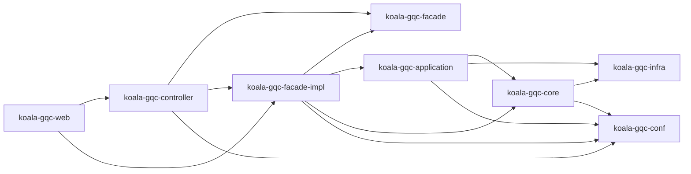
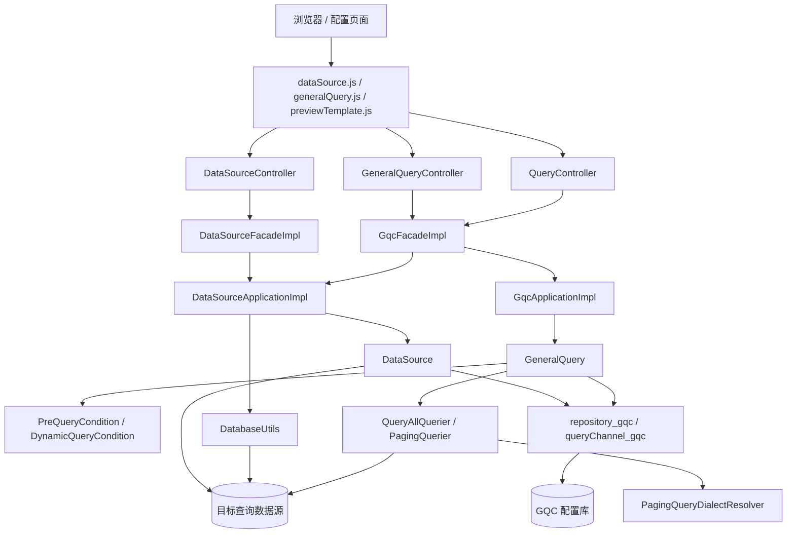
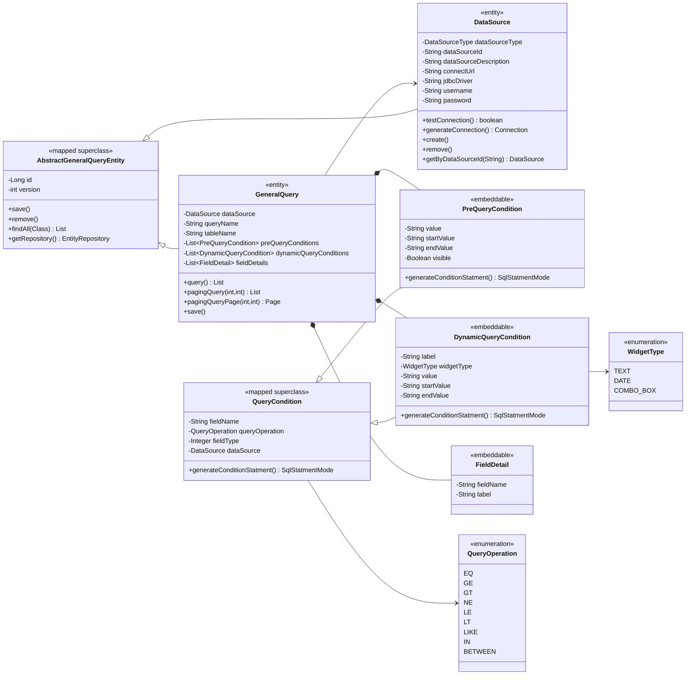
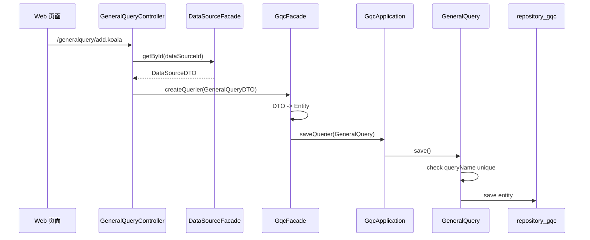
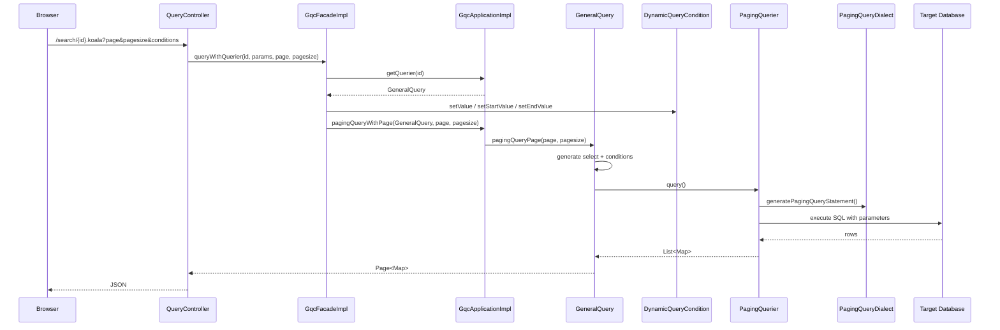

# koala-gqc 设计文档

## 1. 文档范围

本文档说明 `koala-gqc` 通用查询配置模块的模块边界、架构分层、领域模型、查询执行流程、Mermaid UML、持久化配置、Web 接口和启动注意事项。GQC 的核心目标是让管理员通过页面配置数据源、表、显示字段和查询条件，然后生成可复用的查询页面与分页查询接口。

## 2. 模块定位

`koala-gqc` 是 General Query Configuration 的实现模块，提供“配置式查询”能力：

- 管理查询数据源，支持系统数据源和自定义 JDBC 数据源。
- 从数据源读取表和字段元数据。
- 配置通用查询器，包括查询名称、目标表、显示字段、静态条件和动态条件。
- 根据配置生成 SQL，并使用不同数据库分页方言执行查询。
- 通过 Spring MVC + JSP/FreeMarker 提供查询器配置、预览和运行时查询页面。

## 3. 工程结构

```text
koala-gqc/
├── koala-gqc-conf/          # Spring 根配置、数据库属性、GQC 持久化配置
├── koala-gqc-infra/         # 数据库元数据工具 DatabaseUtils
├── koala-gqc-core/          # 领域模型、查询条件、SQL 生成、分页方言
├── koala-gqc-application/   # 应用服务：DataSourceApplication、GqcApplication
├── koala-gqc-facade/        # 对外 Facade 接口和 DTO
├── koala-gqc-facade-impl/   # Facade 实现和 DTO/Entity 装配器
├── koala-gqc-controller/    # Spring MVC Controller 和 servlet.xml
├── koala-gqc-web/           # WAR、web.xml、JSP、FreeMarker 模板、前端资源
└── pom.xml                  # Maven 聚合工程
```

模块依赖方向：



## 4. 总体架构

GQC 采用典型分层架构：

1. Web 层：JSP/JS 页面负责数据源维护、查询器配置和预览查询。
2. Controller 层：`DataSourceController`、`GeneralQueryController`、`QueryController` 暴露 `.koala` 接口。
3. Facade 层：`DataSourceFacadeImpl`、`GqcFacadeImpl` 处理 DTO 装配、页面数据组合和错误包装。
4. Application 层：`DataSourceApplicationImpl`、`GqcApplicationImpl` 承载事务边界。
5. Domain 层：`DataSource`、`GeneralQuery`、`QueryCondition` 负责业务规则和 SQL 生成。
6. Infra 层：`DatabaseUtils` 读取数据库表和字段元数据。
7. Persistence 层：JPA + `repository_gqc` + `queryChannel_gqc` 管理查询配置数据。



## 5. 核心领域模型

### 5.1 DataSource

`DataSource` 表示一个可查询的数据源，持久化到 `KG_DATA_SOURCES`。

关键字段：

- `dataSourceType`：`SYSTEM_DATA_SOURCE` 或 `CUSTOM_DATA_SOURCE`。
- `dataSourceId`：系统数据源 Bean 名称或自定义数据源标识。
- `connectUrl`、`jdbcDriver`、`username`、`password`：自定义 JDBC 连接信息。

关键行为：

- `testConnection()`：检测系统数据源或自定义 JDBC 数据源是否可连通。
- `generateConnection()`：为元数据读取和查询执行生成连接。
- `create()`：保存前校验 `dataSourceId` 唯一性和连接可用性。
- `remove()`：删除前检查是否仍被 `GeneralQuery` 使用。

### 5.2 GeneralQuery

`GeneralQuery` 表示一个通用查询配置，持久化到 `KG_GENERAL_QUERYS`。

关键字段：

- `dataSource`：目标数据源。
- `queryName`：查询器名称，要求唯一。
- `tableName`：目标表名。
- `preQueryConditions`：静态查询条件。
- `dynamicQueryConditions`：运行时由页面输入的动态条件。
- `fieldDetails`：查询结果需要显示的字段。

关键行为：

- `query()`：执行不分页查询。
- `pagingQuery()`：执行分页查询并返回列表。
- `pagingQueryPage()`：执行分页查询并包装 `Page<Map<String,Object>>`。
- `save()`：保存前检查 `queryName` 是否重复。
- `getDynamicQueryConditionByFieldName()`：运行时按字段名回填查询值。

### 5.3 QueryCondition

`QueryCondition` 是查询条件基类，字段包括：

- `fieldName`：条件字段名。
- `queryOperation`：操作符，来自 `QueryOperation`。
- `fieldType`：字段类型，使用 `java.sql.Types`。
- `dataSource`：运行时临时设置，用于 Oracle 时间类型处理。

`PreQueryCondition` 持久化固定值、区间值和可见性。`DynamicQueryCondition` 持久化标签和控件类型，运行时通过请求参数设置 `value/startValue/endValue`。



## 6. 查询配置流程

典型配置流程：

1. 在数据源页面创建或选择数据源。
2. `DataSourceApplicationImpl` 调用 `DataSource.testConnection()` 校验连接。
3. 页面通过 `/generalquery/findAllTable.koala` 获取目标数据源表列表。
4. 页面通过 `/generalquery/findAllColumn.koala` 获取目标表字段和字段类型。
5. 用户配置显示字段、静态条件和动态条件。
6. `GeneralQueryController#add()` 补充数据源 DTO 和创建时间。
7. `GqcFacadeImpl#createQuerier()` 将 DTO 装配为 `GeneralQuery`。
8. `GqcApplicationImpl#saveQuerier()` 调用领域对象 `save()` 持久化。



## 7. 查询执行流程

运行时查询由 `QueryController#search()` 触发：

1. 请求 `/search/{id}.koala?page=1&pagesize=10`。
2. `GqcFacadeImpl#queryWithQuerier()` 加载 `GeneralQuery`。
3. 请求参数按字段名回填到 `DynamicQueryCondition`。
4. `GeneralQuery` 生成 `select field1,field2 from table where 1=1 ...`。
5. 静态条件和动态条件分别追加 SQL 片段和参数值。
6. `PagingQuerier` 读取目标数据库类型，选择分页方言。
7. 使用 Apache DbUtils `QueryRunner` 执行参数化查询。
8. 返回 `Page<Map<String,Object>>`，Controller 输出 JSON。



## 8. 分页方言

分页由 `PagingQueryDialectResolver` 根据 `DatabaseMetaData#getDatabaseProductName()` 选择实现：

| 数据库名称 | 方言类 |
| --- | --- |
| `H2` | `H2PagingQueryDialect` |
| `MySQL` | `MySqlPagingQueryDialect` |
| `Oracle` | `OraclePagingQueryDialect` |
| `Microsoft SQL Server*` | `SqlServerPagingQueryDialect` |
| `DB2/*` | `DB2PagingQueryDialect` |

不在列表内的数据库会抛出 `Paging query do not support ... Dababase`。

## 9. 持久化设计

实体和表：

| 对象 | 表 | 说明 |
| --- | --- | --- |
| `DataSource` | `KG_DATA_SOURCES` | 查询数据源配置 |
| `GeneralQuery` | `KG_GENERAL_QUERYS` | 查询器主配置 |
| `PreQueryCondition` | `KGV_PRE_QUERY_CONDITIONS` | 静态条件集合表 |
| `DynamicQueryCondition` | `KGV_DYNAMIC_QUERY_CONDITIONS` | 动态条件集合表 |
| `FieldDetail` | `KGV_FIELD_DETAILS` | 显示字段集合表 |

持久化配置：

- `gqc-standalone-persistence.xml`：GQC 独立数据源，创建 `entityManagerFactory_gqc`、`transactionManager_gqc`、`repository_gqc`、`queryChannel_gqc`。
- `gqc-shared-persistence.xml`：复用业务系统 `persistenceUnitName=default` 和 `entityManagerFactory`。
- `gqc-mybatis-shared-persistence.xml`：复用 `persistenceUnitName=jpadefault` 和 `entityManagerFactoryJPA`。

领域对象继承 `AbstractGeneralQueryEntity`，通过静态 `repository_gqc` 采用 Active Record 风格保存、删除和查询。

## 10. Web 接口

### 10.1 数据源接口

| 路径 | 说明 |
| --- | --- |
| `/dataSource/add.koala` | 新增数据源 |
| `/dataSource/update.koala` | 更新数据源 |
| `/dataSource/pageJson.koala?page=&pagesize=` | 分页查询数据源 |
| `/dataSource/delete.koala?ids=1,2` | 删除数据源 |
| `/dataSource/get/{id}.koala` | 查询数据源详情 |
| `/dataSource/checkDataSource.koala` | 新增时测试连接 |
| `/dataSource/checkDataSourceById.koala?id=` | 修改时测试连接 |

### 10.2 查询器接口

| 路径 | 说明 |
| --- | --- |
| `/generalquery/pageJson.koala?page=&pagesize=&queryName=` | 分页查询查询器 |
| `/generalquery/add.koala` | 新增查询器 |
| `/generalquery/update.koala` | 更新查询器 |
| `/generalquery/delete.koala?ids=1,2` | 删除查询器 |
| `/generalquery/getById.koala?id=` | 查询查询器详情 |
| `/generalquery/findAllDataSource.koala` | 查询所有数据源 |
| `/generalquery/findAllTable.koala?id=` | 查询数据源下所有表 |
| `/generalquery/findAllColumn.koala?id=&tableName=` | 查询表字段 |

### 10.3 运行时查询接口

| 路径 | 说明 |
| --- | --- |
| `/previewTemplate/{id}.koala` | 返回查询预览页面 |
| `/query/{id}.koala` | 使用 FreeMarker `query.ftl` 生成查询页 |
| `/preview/{id}.koala` | 返回查询器配置 JSON |
| `/search/{id}.koala?page=&pagesize=` | 执行动态条件分页查询 |

## 11. 构建、测试与本地运行

当前项目依赖较老，建议使用 JDK 17，不要使用默认 JDK 25：

```bash
export JAVA_HOME=<JDK17_HOME>
export PATH="$JAVA_HOME/bin:$PATH"
```

在仓库根目录构建：

```bash
mvn -pl koala-gqc/koala-gqc-web -am -DskipTests install
mvn -pl koala-gqc/koala-gqc-core -am test
```

启动 Web 模块时不要和 `-am` 混用：

```bash
cd koala-gqc/koala-gqc-web
mvn jetty:run
# 或临时指定端口
mvn -Djetty.port=17652 jetty:run
```

Jetty 默认端口为 `7652`，可通过 `-Djetty.port=...` 覆盖。

启动完成后会自动初始化两个默认数据源：

| 数据源 ID | 说明 |
| --- | --- |
| `gqc_config` | 指向当前 GQC 配置库，默认 profile 下为 `jdbc:h2:mem:testdb` |
| `gqc_sample` | 本地 H2 示例库，连接地址为 `jdbc:h2:mem:gqc_sample;DB_CLOSE_DELAY=-1` |

测试主要位于 `koala-gqc-core/src/test/java`，覆盖领域对象、条件生成和分页方言。

## 12. 当前兼容性注意事项

- Spring MVC JSON 转换器已使用 `MappingJackson2HttpMessageConverter`，运行时依赖 `jackson-databind`。
- JDK 17 下需要显式补齐 JAXB 运行时依赖，否则 Hibernate Validator 初始化会缺少 `javax.xml.bind.JAXBException`。
- Web 入口和多个页面仍是 JSP。`koala-gqc-web/src/main/webapp/WEB-INF/web.xml` 已将 Jetty 8 的 JSP 编译参数设置为 Java 8，避免 `PWC6033: Error in Javac compilation for JSP`。
- 父 POM 管理的 FreeMarker 版本较旧，`koala-gqc-web` 覆盖为 `freemarker:2.3.31` 以匹配 Spring 4.3 的 `FreeMarkerConfigurer`。
- `GeneralQuery#generateSelectPrefixStatement()` 假设 `fieldDetails` 非空；如果没有显示字段，`deleteCharAt()` 会失败。
- SQL 的表名、字段名来自配置，参数值使用占位符，但表名/字段名仍需要通过 UI 或服务端白名单约束，避免配置错误或注入风险。
- 自定义数据源密码以明文字段保存，生产环境需要加密或外部化管理。
- 分页总数 SQL 通过截取 `from` 之后的内容生成，只适用于当前自动生成的简单查询，不适合复杂 SQL。

## 13. 扩展点

- 新数据库分页支持：新增 `PagingQueryDialect` 实现，并在 `PagingQueryDialectResolver` 中按数据库名称注册。
- 新控件类型：扩展 `WidgetType`、DTO、页面模板和前端渲染逻辑。
- 数据源发现：扩展 `DatabaseUtils` 可支持 schema、view 或按数据库类型定制元数据查询。
- 查询安全策略：在 `GeneralQuery` 保存前校验表名、字段名和字段类型，限制只允许来自目标数据源元数据的字段进入查询配置。
