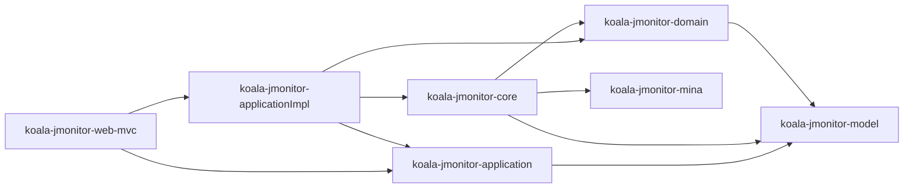
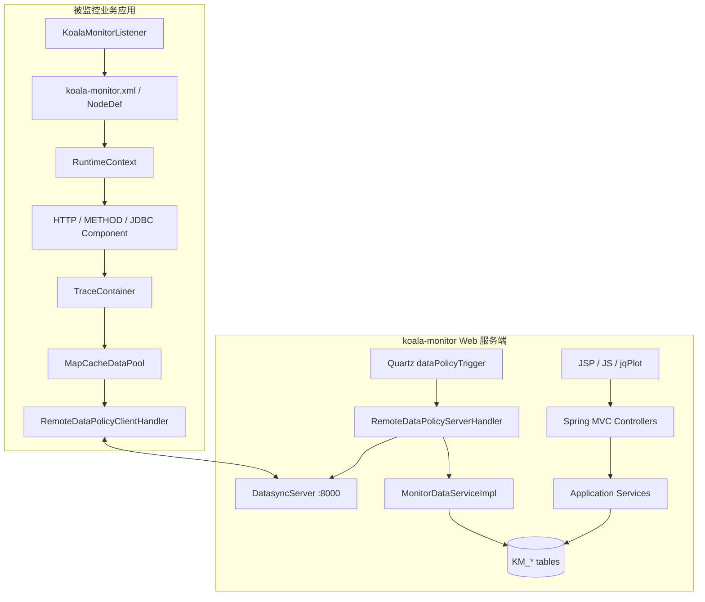
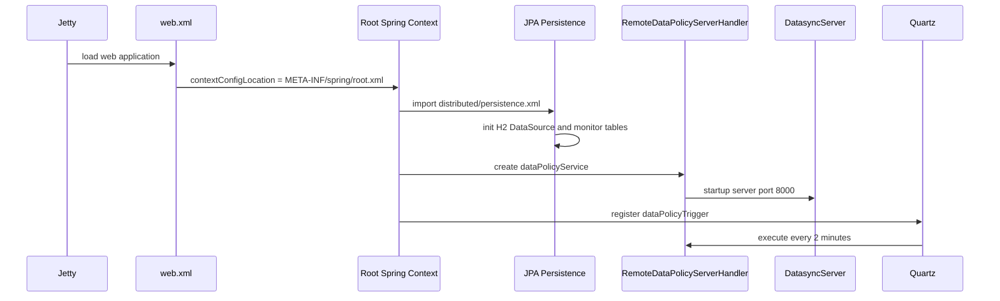
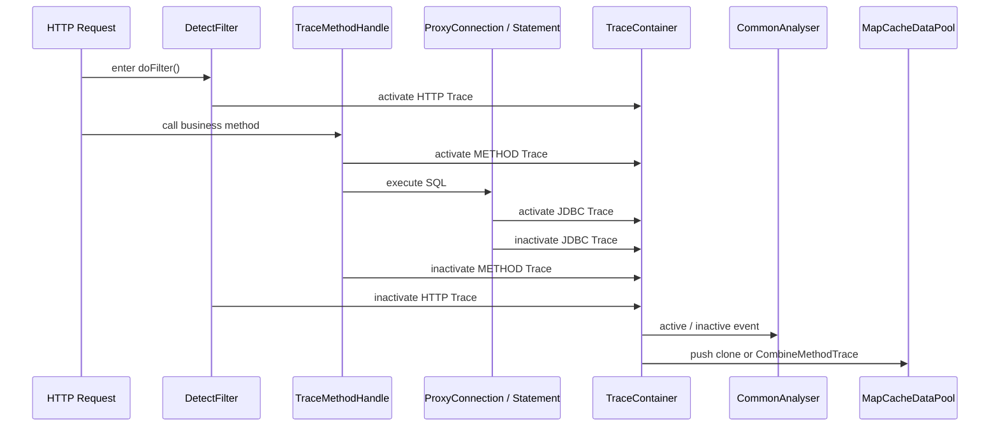
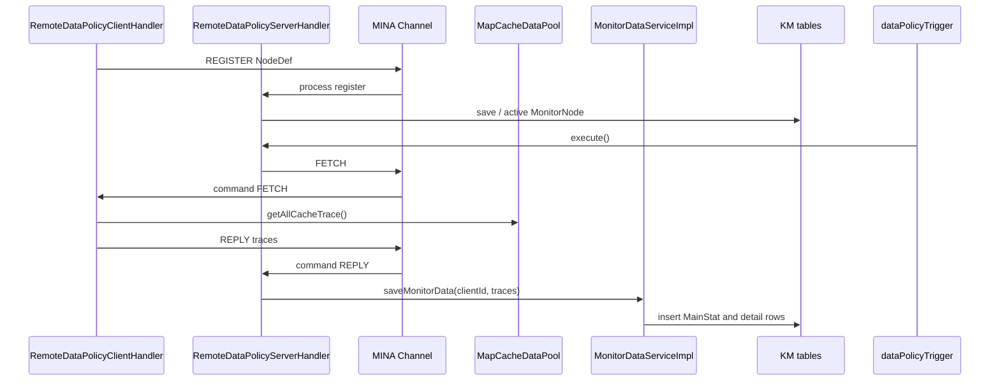
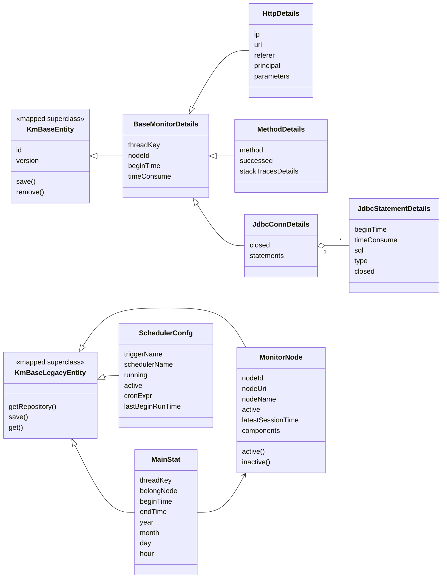

# koala-monitor 设计文档

## 1. 文档范围

本文档说明 `koala-monitor` 监控子系统的模块边界、运行架构、采集流程、同步流程、领域模型、Web 接口、持久化配置、启动方式和扩展点。文档基于当前仓库源码和已经改造后的本地可运行状态编写，UML 均使用 Mermaid。

## 2. 模块定位

`koala-monitor` 是 OpenKoala 的应用运行监控子系统，目标是采集业务系统中的 HTTP 请求、方法调用、JDBC 调用、连接池和服务器状态，并在监控 Web 端集中展示。

核心能力包括：

- 在被监控应用中启动采集上下文，按组件采集 HTTP、METHOD、JDBC 轨迹。
- 使用 `TraceContainer` 统一管理 Trace 生命周期，并通过 `Analyser` 过滤短耗时、超时和异常轨迹。
- 通过本地或远程数据策略同步监控数据；当前 Web 端默认启用远程 MINA 服务端。
- 将监控数据转换为领域实体并落库，支持 HTTP、方法、SQL、堆栈和节点统计查询。
- 通过 Spring MVC + JSP + jqPlot 提供监控页面。

## 3. 工程结构

```text
koala-monitor/
├── koala-jmonitor-model/            # Trace、NodeDef、VO、远程命令模型
├── koala-jmonitor-domain/           # JPA 领域实体和 MonitorDataService
├── koala-jmonitor-application/      # 应用服务接口
├── koala-jmonitor-applicationImpl/  # 应用服务实现、Spring/JPA/Quartz 配置
├── koala-jmonitor-mina/             # MINA 客户端/服务端通信封装
├── koala-jmonitor-core/             # 采集组件、Trace 生命周期、数据策略、ASM/JDBC 代理
├── koala-jmonitor-web-mvc/          # WAR、Controller、JSP、JS/CSS、Jetty 配置
├── doc/                             # 历史 Word/JPG 设计材料
└── pom.xml                          # Maven 聚合工程
```

模块依赖方向：



## 4. 总体架构

`koala-monitor` 同时包含“被监控端采集 SDK”和“监控服务端 Web 控制台”：

1. 被监控端：业务应用引入 `koala-jmonitor-core`，由 `KoalaMonitorListener` 读取 `koala-monitor.xml`，启动 HTTP、METHOD、JDBC 等采集组件。
2. 缓存层：采集到的 `Trace` 按线程维度进入 `MapCacheDataPool`。
3. 同步层：远程模式下 `RemoteDataPolicyClientHandler` 连接监控 Web 端的 MINA 服务；Web 端 `RemoteDataPolicyServerHandler` 定时拉取数据。
4. 持久化层：`MonitorDataServiceImpl` 将 Trace 转换为 `MainStat`、`HttpDetails`、`MethodDetails`、`JdbcConnDetails` 等实体。
5. 查询层：`MonitorDataManageApplicationImpl`、`MonitorNodeManageApplicationImpl`、`ServiceMonitorApplicationIpml` 提供查询和配置操作。
6. Web 层：`MonitorController`、`NodeInfoController`、`ServiceMonitorController` 暴露 `.koala` 接口，JSP/JS 负责展示。



## 5. 启动与运行链路

### 5.1 监控 Web 端启动

`koala-jmonitor-web-mvc` 是当前可直接运行的监控控制台。启动时：

- `web.xml` 加载 `DayatangContextLoaderListener` 和 `DispatcherServlet`。
- 根上下文 `META-INF/spring/root.xml` 导入 `base-context.xml` 和 `distributed/root.xml`。
- `distributed/root.xml` 导入 `persistence.xml` 与 `service.xml`。
- `persistence.xml` 初始化 `km_dataSource`、`km_entityManagerFactory`、`km_repository`、`km_queryChannel`。
- `service.xml` 创建 `dataPolicyService`，启动 MINA 服务端，并注册 Quartz 任务 `dataPolicyTrigger`。



### 5.2 被监控端启动

被监控应用通过 Servlet Listener 启动监控上下文：

1. `KoalaMonitorListener` 读取 `context-param` `monitor-config`。
2. `PersistManager` 用 XStream 解析 XML 为 `NodeDef`。
3. `RuntimeContext.registerContext()` 创建全局上下文、Trace 容器和缓存池。
4. `RuntimeContext.startup()` 注册激活的 `ComponentDef` 和 `TaskDef`。
5. 远程策略下启动 `RemoteDataPolicyClientHandler`，向 Web 端注册节点。

## 6. Trace 采集流程

### 6.1 HTTP 采集

`DetectFilter` 包裹请求处理过程。进入请求时创建 `HttpRequestTrace`，调用 `TraceContainer.activateTrace("HTTP", trace)`；请求结束时记录 URI、IP、参数、用户、耗时，并调用 `inactivateTrace()`。HTTP Trace 结束时会清理当前线程 key。

### 6.2 METHOD 采集

`MethodComponent` 根据配置的包名和类名模式扫描字节码，使用 ASM 注入 `TraceMethodHandle`。方法执行前创建 `MethodTrace`，执行后记录耗时和成功状态，异常时记录堆栈。`CommonAnalyser` 会记录每个线程的入口方法，便于方法轨迹归并为 `CombineMethodTrace`。

### 6.3 JDBC 采集

`JdbcComponent` 注入 JDBC Driver 创建逻辑，返回 `ProxyDataSource`、`ProxyConnection`、`ProxyStatement`、`ProxyPreparedStatement` 等代理对象。代理对象记录连接打开/关闭、SQL 执行、Statement 生命周期和耗时。



## 7. 数据同步流程

远程模式下，监控 Web 端作为服务端主动拉取客户端缓存：

1. 客户端 `RemoteDataPolicyClientHandler` 连接 MINA 服务端，发送 `REGISTER`。
2. 服务端 `RemoteDataPolicyServerHandler` 将节点注册为 `MonitorNode`，并保存到缓存与数据库。
3. Quartz 每 2 分钟执行 `dataPolicyTrigger`。
4. 服务端向每个节点发送 `FETCH`。
5. 客户端将 `MapCacheDataPool#getAllCacheTrace()` 中的数据封装为 `REPLY`。
6. 服务端调用 `MonitorDataServiceImpl#saveMonitorData()` 落库。



## 8. 核心领域模型

该模块领域实体继承 `KmBaseEntity` 或 `KmBaseLegacyEntity`，通过 Dayatang `EntityRepository` 使用 Active Record 风格保存和查询。

| 实体 | 表 | 说明 |
| --- | --- | --- |
| `MonitorNode` | `KM_NODE` | 被监控节点，包含节点 ID、URI、名称、状态和组件配置 |
| `SchedulerConfg` | `KM_SCHEDULER_CONF` | Quartz 任务配置，当前主要是 `dataPolicyTrigger` |
| `MainStat` | `KM_MAIN_STAT` | 一次线程轨迹的主记录，按年/月/日/小时冗余统计字段 |
| `HttpDetails` | `KM_HTTP_DETAILS` | HTTP 请求详情 |
| `MethodDetails` | `KM_METHOD_DETAILS` | 方法调用详情、成功状态和异常堆栈 |
| `JdbcConnDetails` | `KM_JDBC_CONN_DETAILS` | JDBC 连接生命周期详情 |
| `JdbcStatementDetails` | `KM_STMT_DETAILS` | SQL 执行详情，归属于 `JdbcConnDetails` |
| `JdbcDetails` | `KM_JDBC_DETAILS` | JDBC 汇总计数实体，当前主要保留模型 |
| `MonitorWarnInfo` | 未启用 | 源码中 `@Entity` 已注释，当前不参与持久化 |



## 9. 应用服务设计

### 9.1 MonitorDataManageApplication

负责监控明细和统计查询：

- HTTP 趋势统计：`getHttpMonitorCount()`。
- HTTP 请求分页：`pageGetHttpMonitorDetails()`。
- 方法调用次数、平均耗时、异常次数分页统计。
- 方法明细分页和堆栈详情查询。
- SQL 明细查询：按方法 ID 反查同线程下 JDBC 连接和 Statement。
- JDBC 连接耗时统计：`getJdbcConnTimeStat()`。

### 9.2 MonitorNodeManageApplication

负责节点和远程状态操作：

- 汇总在线节点和历史节点。
- 更新节点缓存配置。
- 更新远程采集组件配置。
- 远程获取服务器状态、综合状态和 JDBC 连接池状态。

### 9.3 ServiceMonitorApplication

负责同步任务配置：

- 查询所有 `SchedulerConfg`。
- 更新任务 cron 表达式和启用状态。
- 查询单个任务配置。

## 10. Web 接口

所有业务接口经 `*.koala` 进入 Spring MVC。

| Controller | 路径 | 说明 |
| --- | --- | --- |
| `MonitorController` | `/monitor/Monitor/queryAllNodes.koala` | 查询节点列表 |
| `MonitorController` | `/monitor/Monitor/httpMonitorCount.koala` | HTTP 请求趋势统计 |
| `MonitorController` | `/monitor/Monitor/methodMonitorCount.koala` | 方法调用次数/耗时/异常统计 |
| `MonitorController` | `/monitor/Monitor/httpMonitorDetail.koala` | HTTP 明细分页 |
| `MonitorController` | `/monitor/Monitor/methodMonitorDetail.koala` | 方法明细分页 |
| `MonitorController` | `/monitor/Monitor/poolMonitorDetail.koala` | JDBC 连接池状态 |
| `MonitorController` | `/monitor/Monitor/sqlsMonitorDetail.koala` | SQL 明细分页 |
| `MonitorController` | `/monitor/Monitor/stackTracesDetail.koala` | 跳转堆栈详情页 |
| `MonitorController` | `/monitor/Monitor/jdbcTimeStat.koala` | JDBC 连接耗时统计 |
| `NodeInfoController` | `/monitor/NodeInfo/queryAllNodes.koala` | 节点列表 |
| `NodeInfoController` | `/monitor/NodeInfo/serverSummryInfo.koala` | 节点服务器概览 |
| `NodeInfoController` | `/monitor/NodeInfo/updateMonitorConfig.koala` | 更新节点采集组件配置 |
| `NodeInfoController` | `/monitor/NodeInfo/getScheduleConf.koala` | 查询同步任务配置 |
| `NodeInfoController` | `/monitor/NodeInfo/updateScheduleConf.koala` | 更新同步任务配置 |
| `ServiceMonitorController` | `/monitor/ServiceMonitor/queryAllSchedulers.koala` | 查询全部调度任务 |
| `ServiceMonitorController` | `/monitor/ServiceMonitor/updateScheduleConf.koala` | 更新调度任务 |

主要页面位于 `koala-jmonitor-web-mvc/src/main/webapp/pages/monitor/`，前端脚本位于 `src/main/webapp/js/monitor/`。

## 11. 持久化与配置

### 11.1 数据源

当前默认激活 H2 profile：

```text
jdbc:h2:mem:testdb;DB_CLOSE_DELAY=-1;DB_CLOSE_ON_EXIT=FALSE
```

`DB_CLOSE_DELAY=-1` 用于保持内存库在连接关闭后不丢表。生产或长期调试可切换 MySQL profile，配置位于 `koala-monitor/pom.xml`。

### 11.2 Spring/JPA 配置

关键文件：

- `koala-jmonitor-applicationImpl/src/main/resources/META-INF/spring/distributed/persistence.xml`
- `koala-jmonitor-applicationImpl/src/main/resources/META-INF/spring/distributed/jpa.xml`
- `koala-jmonitor-applicationImpl/src/main/resources/META-INF/sql/monitor-h2-schema.sql`

当前持久化层使用：

- `DriverManagerDataSource` 作为本地开发数据源。
- `DataSourceInitializer` 执行 H2 建表脚本。
- `LocalContainerEntityManagerFactoryBean` 创建 `monitor` persistence unit。
- `SharedEntityManagerBean` 注入 `EntityRepositoryJpa`，确保 JPQL update 使用 Spring 事务绑定的 `EntityManager`。
- `km_transactionManager`、`km_transactionTemplate` 和 AOP advice 管理事务。

### 11.3 调度与同步配置

`distributed/service.xml` 注册：

- `dataPolicyService`：`RemoteDataPolicyServerHandler`。
- `dataPolicyTrigger`：cron 为 `0 0/2 * * * ?`，每 2 分钟拉取一次监控节点数据。
- `monitorDataService`：负责 Trace 落库。

MINA 服务端端口来自：

```text
koala-jmonitor-web-mvc/src/main/resources/META-INF/props/mina-server.properties
server.port=8000
```

## 12. 本地启动

当前已经验证可用的启动方式：

```bash
cd koala-monitor
JAVA_HOME=<JDK17_HOME> mvn -DskipTests install

cd koala-jmonitor-web-mvc
JAVA_HOME=<JDK17_HOME> mvn jetty:run
```

Jetty 端口固定为 `7653`：

```text
http://localhost:7653/
```

已验证的接口：

```text
GET /monitor/NodeInfo/queryAllNodes.koala
GET /monitor/ServiceMonitor/queryAllSchedulers.koala
GET /monitor/Monitor/queryAllNodes.koala
```

## 13. 扩展点

### 13.1 新增采集组件

新增组件需要实现 `Component`，并在 `ComponentFactory#getInstance(String type)` 中注册。组件启动时接收 `ComponentContext`，可以读取 `ComponentDef.properties` 并注册 `Analyser`。

### 13.2 新增分析器

新增分析器实现 `Analyser`，通过 `TraceLiftcycleManager#registerAnalyser(traceType, analyser)` 注册。分析器应处理三类事件：`activeProcess`、`inactiveProcess`、`destoryProcess`。

### 13.3 新增数据策略

数据策略实现 `DataPolicyHandler`。当前已有：

- `RemoteDataPolicyClientHandler` / `RemoteDataPolicyServerHandler`：远程集中式。
- `LocalDataPolicyHandler`：本地采集本地落库。

新增策略需要明确节点注册、数据拉取、配置更新和状态查询的行为。

## 14. 当前改造状态与约束

- 当前 Web 本地开发模式禁用了历史安全登录链路，因为旧安全适配模块和类已不可用。
- `koala-jmonitor-web-mvc` 的 `auth` Controller 源码仍保留，但 Maven 编译已排除，Spring MVC 也排除了该包扫描。
- `ServerStatusCollector` 已从 Sigar 改为 JDK API；CPU、内存和磁盘空间可用，磁盘读写速率不再依赖 Sigar 采集。
- H2 为内存数据库，重启后业务数据会清空；建表脚本只保证本地启动和页面访问。
- 包名中历史拼写 `contorller` 不建议改动，避免破坏现有资源和扫描配置。
- `MonitorWarnInfo` 当前不是 JPA 实体，预警查询接口仍是未完成实现。
