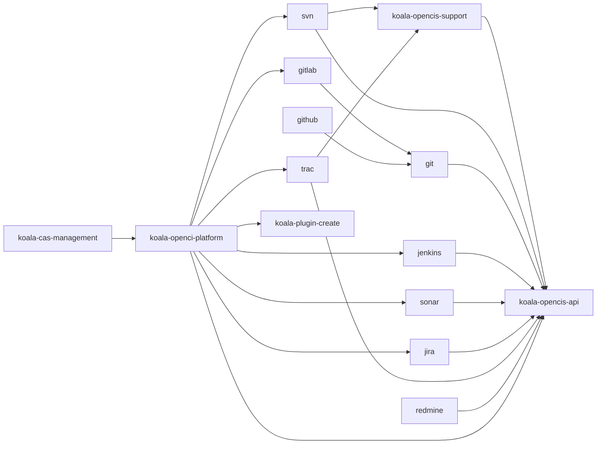
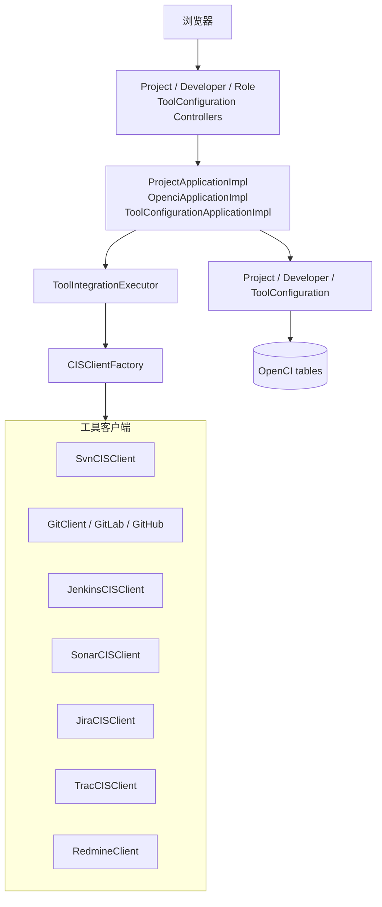
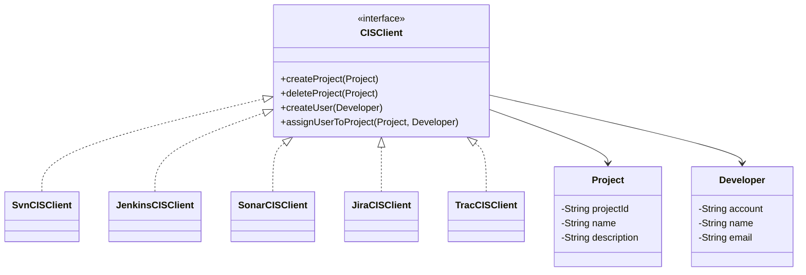
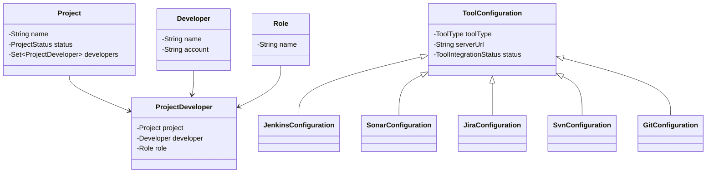
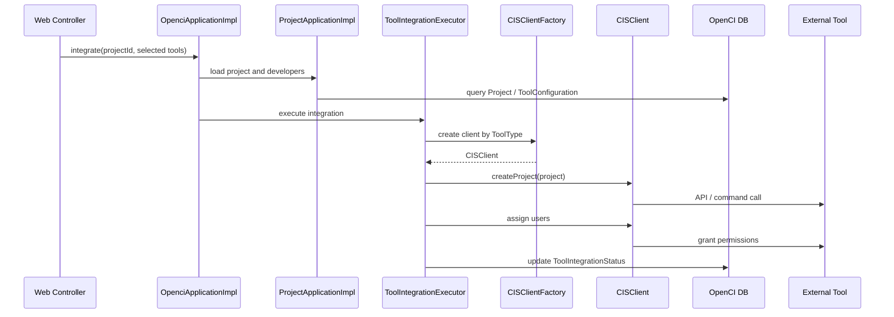

# koala-opencis 设计文档

## 1. 文档范围

本文档说明 `koala-opencis` 持续集成/项目协作子系统的模块边界、架构设计、领域模型、工具集成流程、Mermaid UML、启动方式和当前兼容性说明。

## 2. 模块定位

`koala-opencis` 面向项目交付工具链整合，提供对 SCM、CI、质量平台、缺陷平台和 CAS 用户管理的统一配置与调用。

核心能力包括：

- 抽象统一的 `CISClient` 接口，适配 SVN、Git、GitLab、GitHub、Jenkins、Sonar、Jira、Trac、Redmine。
- 在 `koala-openci-platform` 中维护项目、开发者、角色、工具配置和集成状态。
- 通过 Web 控制台配置工具连接参数，并触发项目集成。
- 提供 `koala-cas-management` 管理 CAS 服务和应用用户。

## 3. 工程结构

```text
koala-opencis/
├── koala-opencis-api/          # Project、Developer、CISClient 等统一接口
├── koala-opencis-support/      # SSH、SVN 配置等支撑工具
├── koala-opencis-svn/          # SVN 命令式客户端
├── koala-opencis-git/          # JGit 客户端
├── koala-opencis-gitlab/       # GitLab 集成
├── koala-opencis-github/       # GitHub 集成
├── koala-opencis-jenkins/      # Jenkins 集成适配
├── koala-opencis-sonar/        # Sonar 集成
├── koala-opencis-jira/         # Jira 集成
├── koala-opencis-trac/         # Trac 集成
├── koala-opencis-redmine/      # Redmine API 客户端
├── koala-openci-platform/      # 平台配置、项目集成应用服务和 Web
├── koala-cas-management/       # CAS 服务与用户管理
└── pom.xml                     # Maven 聚合工程
```

模块依赖方向：



## 4. 总体架构

`koala-opencis` 分为三层：

1. 工具客户端层：各 `koala-opencis-*` 模块封装具体外部系统 API 或命令。
2. 平台编排层：`koala-openci-platform` 保存工具配置，按项目维度调用多个客户端完成集成。
3. Web 管理层：Spring MVC Controller 暴露项目、开发者、角色和工具配置页面。



## 5. 核心接口与领域模型

`koala-opencis-api` 提供工具层统一契约：



平台领域模型：



## 6. 项目集成流程

项目创建和工具集成由 `OpenciApplicationImpl` 与 `ToolIntegrationExecutor` 编排：



## 7. CAS 管理模块

`koala-cas-management` 管理 CAS 服务和用户：

- `koala-cas-management-core`：`AppUser` 等领域模型。
- `koala-cas-management-application`：服务管理、用户管理应用接口。
- `koala-cas-management-applicationImpl`：应用服务实现。
- `koala-cas-management-web`：Spring MVC/Tomcat Web 入口。
- `koala-cas-management-conf`：数据库和 Spring 配置。

当前为了恢复根 reactor 编译，旧安全接口强绑定的 CAS 用户 REST 实现已从编译中排除。保留服务管理和基础结构，后续应迁移到当前 `koala-security` Facade。

## 8. 当前兼容性改造

本地可编译状态包含以下改造：

- 根 reactor 已包含 `koala-opencis`。
- `koala-openci-platform-application` 对 `koala-plugin-create` 使用当前 `${project.parent.version}`。
- 移除了不可用的 `nl.tudelft:jenkins-ws-client:0.14-SNAPSHOT`。
- `JenkinsCISClient` 当前是可编译的本地占位适配，负责参数校验和认证字段保存；真实 Jenkins 创建 Job 需接入维护中的 Jenkins API。
- `koala-cas-management` 中依赖旧安全包的用户 REST/服务实现已排除编译。

## 9. 构建与启动

编译 OpenCIS：

```bash
mvn -pl koala-opencis -am -DskipTests compile
```

启动 OpenCI 平台 Web：

```bash
mvn -pl koala-opencis/koala-openci-platform/koala-openci-platform-web -am jetty:run
```

默认上下文：

```text
http://localhost:8080/openci-platform
```

启动 CAS 管理 Web：

```bash
mvn -pl koala-opencis/koala-cas-management/koala-cas-management-web -am tomcat7:run
```

默认端口为 `8080`。如与其他 Web 应用冲突，需要通过插件参数或 POM 配置调整端口。

## 10. 扩展建议

- 新接入工具应先实现 `CISClient`，再在 `CISClientFactory` 和平台配置模型中登记。
- 外部系统调用应隔离在具体客户端模块，平台层只处理编排和状态。
- 工具认证信息不要写入源码；优先通过数据库配置或本地属性文件注入。
- Jenkins、Jira、Sonar 等 API 较旧，恢复真实联调前需要确认目标服务器版本和客户端库兼容性。
