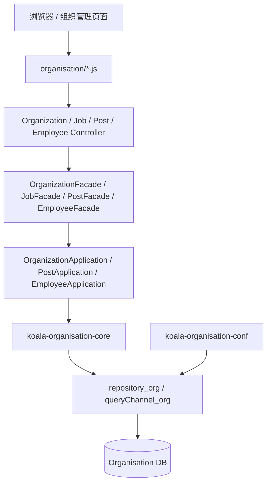
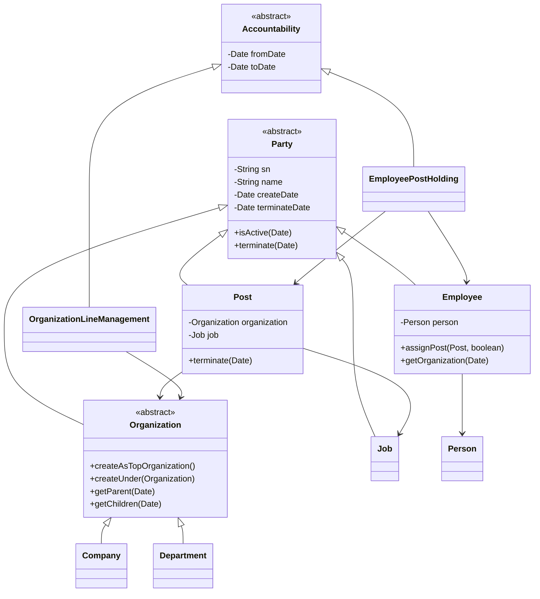
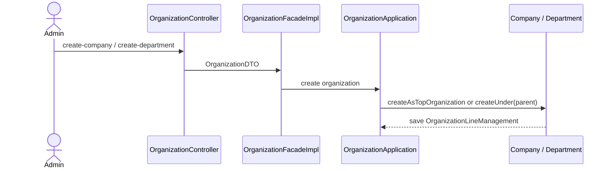
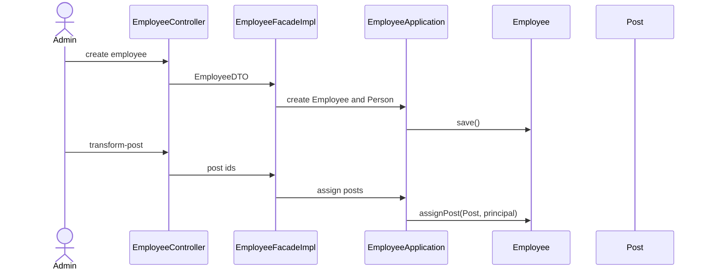

# koala-organisation 设计文档

## 1. 文档范围

本文档说明 `koala-organisation` 组织机构子系统的聚合模块设计、分层架构、领域模型、Web/API 入口、持久化配置和 Mermaid UML。领域核心细节见 `koala-organisation-core/DESIGN.md`。

## 2. 子系统定位

`koala-organisation` 负责公司、部门、职务、岗位、员工、人员信息和组织任职关系管理。它提供独立组织管理后台，也为 `koala-security-org` 的员工用户、组织范围授权和上层业务流程提供组织数据。

## 3. 工程结构

```text
koala-organisation/
├── koala-organisation-conf/          # Spring、JPA、数据源、repository_org
├── koala-organisation-core/          # 组织领域模型
├── koala-organisation-application/   # 应用服务和事务边界
├── koala-organisation-facade/        # Facade 接口与 DTO
├── koala-organisation-facade-impl/   # Facade 实现与装配器
├── koala-organisation-controller/    # Spring MVC Controller
└── koala-organisation-web/           # WAR、JSP、JS、CSS、web.xml
```

## 4. 架构设计

系统采用标准分层架构。Controller 只处理 HTTP 参数和返回值，Facade 负责 DTO 转换，Application 负责编排领域对象，Core 通过 `repository_org` 进行持久化。



## 5. 核心领域模型

核心领域由 `Party` 继承体系和 `Accountability` 关系体系组成：

- `Company`、`Department`：组织机构。
- `Job`：职务，例如会计、经理。
- `Post`：岗位，绑定组织机构和职务。
- `Person`：自然人基础信息。
- `Employee`：员工身份，关联 `Person`。
- `OrganizationLineManagement`：组织上下级关系。
- `EmployeePostHolding`：员工任职关系。



## 6. 主要业务流程

### 6.1 创建组织机构



### 6.2 员工入职和任岗



## 7. Web/API 入口

主要 Controller 路径：

- `/organization`：公司/部门创建、更新、组织树、终止组织。
- `/job`：职务分页、查询、创建、更新、终止。
- `/post`：岗位分页、按组织查询、创建、更新、终止。
- `/employee`：员工分页、按组织查询、创建、更新、调岗、终止。

页面位于 `koala-organisation-web/src/main/webapp/pages/organisation`，脚本位于 `koala-organisation-web/src/main/webapp/js/organisation`。

## 8. 持久化与启动

`koala-organisation-conf` 提供独立持久化配置：

- `organisation-root.xml`：导入基础上下文和独立持久化配置。
- `organisation-standalone-persistence.xml`：配置 `repository_org`、`queryChannel_org`、事务管理器和实体扫描。
- `database.properties`：本地默认数据源配置。

启动命令：

```bash
mvn -pl koala-organisation/koala-organisation-web -am jetty:run
```

该 Web POM 未固定端口，Jetty 默认使用 `8080`，默认上下文为 `/`。

## 9. 集成关系

- `koala-security-org` 通过 `EmployeeUser` 关联 `Employee`，通过 `OrganisationScope` 关联 `Organization`。
- `koala-bpm` 可使用组织、岗位、员工数据进行流程参与者和审批人解析。
- 组织数据可以作为 `koala-gqc` 的查询对象，被配置式查询页面复用。
