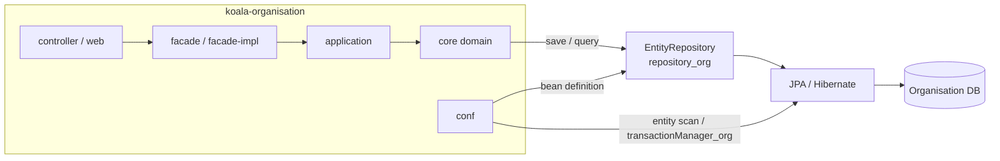
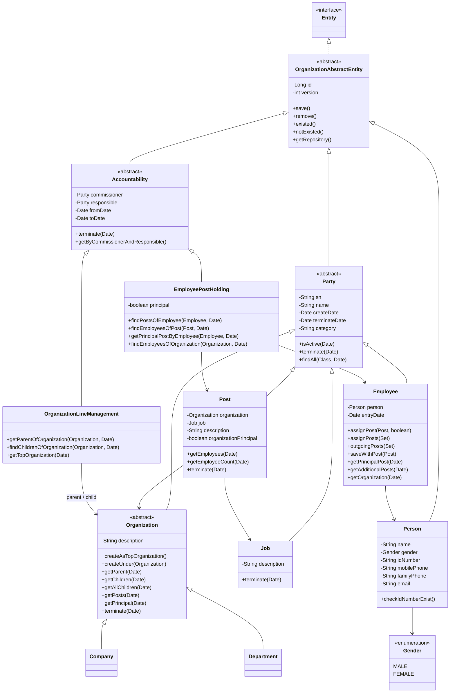
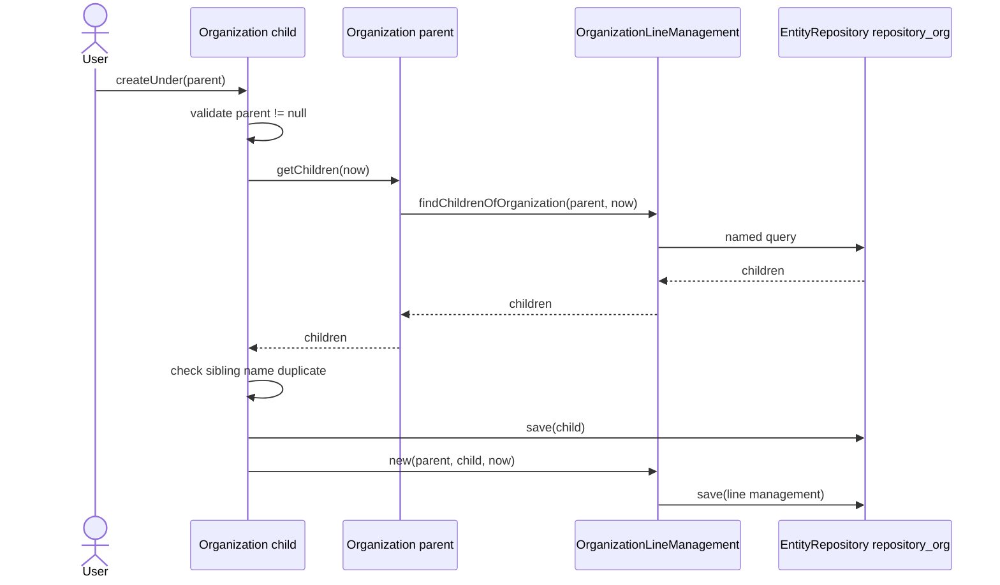
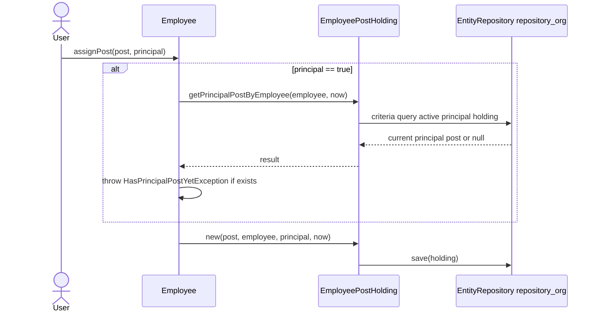
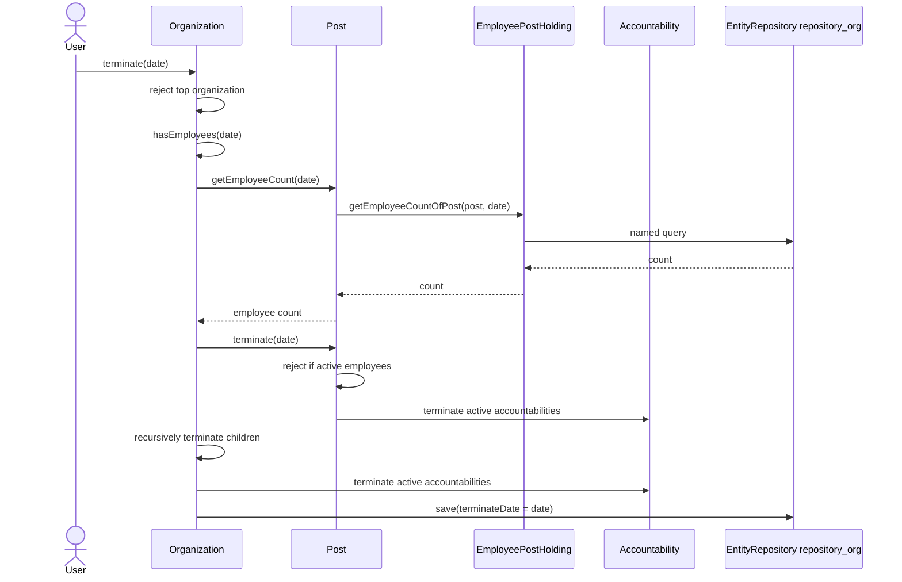

# koala-organisation-core 设计文档

## 1. 文档范围

本文档描述 `koala-organisation-core` 模块的领域设计、架构边界、核心对象、持久化映射、主要业务流程和 UML。该模块是 `koala-organisation` 子系统的领域核心，负责表达组织机构、人员、岗位、职务以及它们之间带时间有效期的组织关系。

模块路径：

```text
koala-organisation/koala-organisation-core
```

## 2. 模块定位

`koala-organisation-core` 不包含 Controller、Facade、Application Service 或 Web 视图。它主要由领域实体和领域异常组成，上层模块通过这些领域对象完成组织业务操作。

在 `koala-organisation` 聚合工程中，模块关系大致如下：

```text
koala-organisation
├── koala-organisation-conf          # Spring、JPA、数据源、repository_org 配置
├── koala-organisation-core          # 本文档描述的领域核心
├── koala-organisation-application   # 应用服务层
├── koala-organisation-facade        # 对外接口与 DTO 契约
├── koala-organisation-facade-impl   # Facade 实现
├── koala-organisation-controller    # Web/API 控制层
└── koala-organisation-web           # JSP 与静态资源
```

## 3. 架构设计

### 3.1 架构风格

该模块采用 DDD 风格的领域模型，但实现上更接近 Active Record：领域对象继承 `OrganizationAbstractEntity` 后，直接通过静态 `EntityRepository` 完成 `save()`、`remove()`、查询和命名查询调用。

核心特点：

- 领域规则集中在实体方法中，例如 `Organization.terminate()`、`Post.save()`、`Employee.assignPost()`。
- 关系实体使用 `fromDate/toDate` 表示时间有效期，支持历史时间点查询。
- 持久化仓储通过 `InstanceFactory.getInstance(EntityRepository.class, "repository_org")` 获取。
- Spring/JPA 配置不在 core 模块内，而在 `koala-organisation-conf` 中提供。

### 3.2 组件视图



## 4. 代码结构

```text
src/main/java/org/openkoala/organisation/core
├── OrganisationException.java                    # 领域异常基类
├── *Exception.java / OrganizationHasEmployee.java # 具体领域规则异常
└── domain
    ├── OrganizationAbstractEntity.java           # 实体基类，封装 ID、version、repository
    ├── Party.java                                # 当事人抽象类
    ├── Organization.java                         # 机构抽象类
    ├── Company.java / Department.java            # 机构类型
    ├── Job.java                                  # 职务
    ├── Post.java                                 # 岗位
    ├── Person.java / Gender.java                 # 自然人信息
    ├── Employee.java                             # 员工
    ├── Accountability.java                       # 带有效期的责任关系
    ├── OrganizationLineManagement.java           # 组织上下级关系
    └── EmployeePostHolding.java                  # 员工任职关系
```

测试位于：

```text
src/test/java/org/openkoala/organisation/domain
src/test/java/org/openkoala/organisation/utils
```

## 5. 核心领域模型

### 5.1 基础实体

`OrganizationAbstractEntity` 是所有持久化实体的基类，提供：

- `id`：数据库主键。
- `version`：JPA 乐观锁版本。
- `save()`、`remove()`：通过 `repository_org` 持久化。
- `get()`、`load()`、`findAll()`：静态仓储访问方法。
- `existed()`、`notExisted()`：实体存在性判断。

该设计减少了显式 Repository 类，但也让领域模型直接依赖持久化基础设施。

### 5.2 Party 体系

`Party` 表示组织系统中的“当事人”，包含统一生命周期字段：

- `sn`：编码。
- `name`：名称。
- `createDate`：创建日期。
- `terminateDate`：终止日期，默认 `DateUtils.MAX_DATE`。
- `category`：单表继承鉴别字段。

`Party` 的子类包括：

- `Company`：公司。
- `Department`：部门。
- `Job`：职务，例如“会计”“总经理”。
- `Post`：岗位，例如“广州分公司财务总监”。
- `Employee`：员工。

### 5.3 组织模型

`Organization` 是 `Company` 和 `Department` 的抽象父类。组织上下级关系不通过直接父子字段维护，而是通过 `OrganizationLineManagement` 关系实体维护。

主要能力：

- `createAsTopOrganization()`：创建顶级机构。
- `createUnder(Organization parent)`：在父机构下创建子机构。
- `getParent(Date date)`：按日期查询父机构。
- `getChildren(Date date)`：按日期查询直接子机构。
- `getAllChildren(Date date)`：递归查询所有下级机构。
- `getFullName()`：按父级链路拼接全名。
- `terminate(Date date)`：撤销机构，并终止相关岗位、下级机构和责任关系。

### 5.4 职务与岗位

`Job` 表示通用职务，`Post` 表示某个组织下的具体岗位。一个岗位同时关联一个 `Organization` 和一个 `Job`。

示例：

```text
Job:  会计
Organization: 财务部
Post: 财务部会计岗
```

`Post` 负责维护岗位级规则：

- 同一个组织和职务组合下不能存在重复有效岗位。
- 有效岗位名称不能重复。
- 一个机构只能有一个主负责岗位。
- 岗位下仍有有效员工任职时不能终止。

### 5.5 人员与员工

`Person` 表示自然人身份信息，包括姓名、性别、身份证号、电话、邮箱等。`Employee` 表示自然人在组织中的员工身份。

两者关系：

- `Employee` 继承 `Party`，参与组织关系和岗位任职。
- `Employee` 通过 `ManyToOne(cascade = PERSIST, MERGE)` 关联 `Person`。
- 员工姓名变更会同步写入关联的 `Person.name`。
- 身份证号非空时需要全局唯一。

### 5.6 责任关系模型

`Accountability<C extends Party, R extends Party>` 是责任关系抽象基类。它用 `commissioner`、`responsible`、`fromDate`、`toDate` 表达两个 `Party` 之间在某段时间内有效的关系。

当前有两个子类：

- `OrganizationLineManagement extends Accountability<Organization, Organization>`：组织上下级关系。`commissioner` 是父机构，`responsible` 是子机构；顶级机构的 `commissioner` 为 `null`。
- `EmployeePostHolding extends Accountability<Post, Employee>`：员工任职关系。`commissioner` 是岗位，`responsible` 是员工，额外包含 `principal` 表示是否主岗。

## 6. UML 类图



## 7. 关键业务流程

### 7.1 创建子机构



### 7.2 分配员工岗位



### 7.3 撤销机构



## 8. 持久化设计

### 8.1 仓储与事务

core 模块本身只声明领域对象，运行时持久化依赖 `koala-organisation-conf`：

- `organisation-root.xml` 导入基础上下文和独立 JPA 持久化配置。
- `organisation-standalone-persistence.xml` 扫描 `org.openkoala.organisation.core.domain`。
- `repository_org` 使用 `KoalaEntityRepositoryJpa`。
- `transactionManager_org` 使用 `JpaTransactionManager`。

### 8.2 表和继承

主要实体映射：

| 类型 | 映射方式 | 说明 |
| --- | --- | --- |
| `Party` 继承树 | `@Inheritance(SINGLE_TABLE)`，`KO_PARTIES`，`CATEGORY` | 保存 `Company`、`Department`、`Job`、`Post`、`Employee` 等当事人类型 |
| `Accountability` 继承树 | `@Inheritance(SINGLE_TABLE)`，`KO_ACCOUNTABILITIES`，`CATEGORY` | 保存组织上下级关系和员工任职关系 |
| `Person` | `KO_PERSONS` | 保存自然人身份信息 |

注意：`Organization` 类上也声明了 `@Table(name = "KO_ORGANIZATIONS")`。由于 `Party` 是单表继承根，维护映射或生成 DDL 时应以实际 Hibernate/JPA 运行结果为准，避免只根据子类注解修改数据库结构。

### 8.3 时间有效性

模块通过统一的时间谓词表达“当前有效”：

```text
Party:          createDate <= date && terminateDate > date
Accountability: fromDate   <= date && toDate        > date
```

查询组织树、岗位、员工任职、机构负责人时都应传入明确的 `Date`，避免混用业务日期和系统当前时间。

## 9. 领域规则与异常

| 规则 | 触发位置 | 异常 |
| --- | --- | --- |
| 有效 `Party.sn` 不能重复 | `Party.save()` | `SnIsExistException` |
| 非空身份证号不能重复 | `Person.save()`、`Employee.save()` | `IdNumberIsExistException` |
| 只能有一个顶级机构 | `Organization.createAsTopOrganization()` | `OrganisationException` |
| 子机构名称在同一父机构下不能重复 | `Organization.createUnder()`、`Organization.update()` | `NameExistException` |
| 顶级机构不能撤销 | `Organization.terminate()` | `TerminateRootOrganizationException` |
| 机构及下级机构仍有员工时不能撤销 | `Organization.terminate()` | `TerminateNotEmptyOrganizationException` |
| 职务仍有关联岗位时不能撤销 | `Job.terminate()` | `TheJobHasPostAccountabilityException` |
| 岗位按组织和职务不能重复 | `Post.save()` | `PostExistException` |
| 有效岗位名称不能重复 | `Post.save()` | `NameExistException` |
| 同一机构只能有一个主负责岗位 | `Post.save()` | `OrganizationHasPrincipalYetException` |
| 岗位仍有员工任职时不能撤销 | `Post.terminate()` | `TerminateHasEmployeePostException` |
| 员工只能有一个主岗 | `Employee.assignPost()` | `HasPrincipalPostYetException` |

## 10. 查询设计

模块主要通过命名查询和 dddlib CriteriaQuery 查询领域状态：

- `OrganizationLineManagement`
  - `getParentOfOrganization`
  - `findChildrenOfOrganization`
  - `findByResponsible`
- `Post`
  - `findByOrganization`
  - `findByJob`
  - `findCountOfOrganization`
- `EmployeePostHolding`
  - `getPostsOfEmployee`
  - `getEmployeesOfPost`
  - `getEmployeesOfJob`
  - `getManagerOfOrganization`
  - `getEmployeeCountOfPost`
  - `getAdditionalPostsOfEmployee`
  - `findEmployeesOfOrganization`
  - `getOrganizationOfEmployee`
- `Accountability`
  - `Accountability.findAccountabilitiesByParty`

维护查询时应统一保留时间有效性过滤，尤其是 `fromDate/toDate` 和 `createDate/terminateDate`。

## 11. 测试设计

集成测试基类：

```text
AbstractIntegrationTest
```

测试配置：

```text
@ContextConfiguration("classpath*:META-INF/spring/organisation-root.xml")
@TransactionConfiguration(transactionManager = "transactionManager_org", defaultRollback = true)
```

核心测试类：

- `OrganizationIntegrationTest`：组织树、全名、创建子机构、撤销机构。
- `OrganizationLineManagementIntegrationTest`：组织上下级关系查询。
- `EmployeeIntegrationTest`：员工岗位、主岗、兼职、离任、身份证重复。
- `EmployeePostHoldingIntegrationTest`：任职关系、机构员工、机构负责人。
- `PostIntegrationTest`：岗位查询、负责人岗位唯一性。
- `JobIntegrationTest`：有关联岗位的职务不能撤销。
- `PartyIntegrationTest`：当事人查询、编号唯一、终止关系级联。
- `AccountabilityIntegrationTest`：通用责任关系查询。

常用命令：

```bash
mvn -pl koala-organisation/koala-organisation-core test
mvn -pl koala-organisation/koala-organisation-core -Dtest=EmployeeIntegrationTest test
```

## 12. 扩展建议

新增组织关系类型时，优先继承 `Accountability`，复用 `commissioner/responsible/fromDate/toDate` 模型。例如新增“虚线汇报关系”时，可以创建新的 `Accountability<Organization, Organization>` 子类，而不是在 `Organization` 上新增直接字段。

新增 `Party` 子类型时，需要：

1. 继承 `Party` 或其合适子类。
2. 增加 `@Entity` 和 `@DiscriminatorValue`。
3. 明确 `equals()`、`hashCode()` 的业务身份。
4. 补充保存、终止、唯一性等领域规则。
5. 增加对应集成测试。

维护现有流程时，避免绕过领域方法直接修改字段。例如不要直接设置 `terminateDate` 来撤销机构，应调用 `terminate(date)`，因为该方法会检查员工占用并级联终止相关关系。

## 13. 已知设计注意点

- 领域对象直接持有静态仓储入口，测试和运行时必须保证 `repository_org` 可用。
- 多个方法内部直接使用 `new Date()`，调用方如果需要历史回溯或可重复测试，应优先使用显式带 `Date` 参数的查询方法。
- `equals()` 和 `hashCode()` 多数基于业务字段，例如 `sn`、`name`、`idNumber`，修改这些字段可能影响集合行为。
- `Accountability.findAccountabilitiesByParty` 的 JPQL 包含 `or` 和 `and` 混合条件，维护时建议确认括号优先级是否符合“任一端参与且关系在日期内有效”的预期。
- `EmployeeMustHaveAtLeastOnePostException` 当前相关测试被注释，说明“员工至少保留一个岗位”的规则尚未在现行实现中强制执行。
