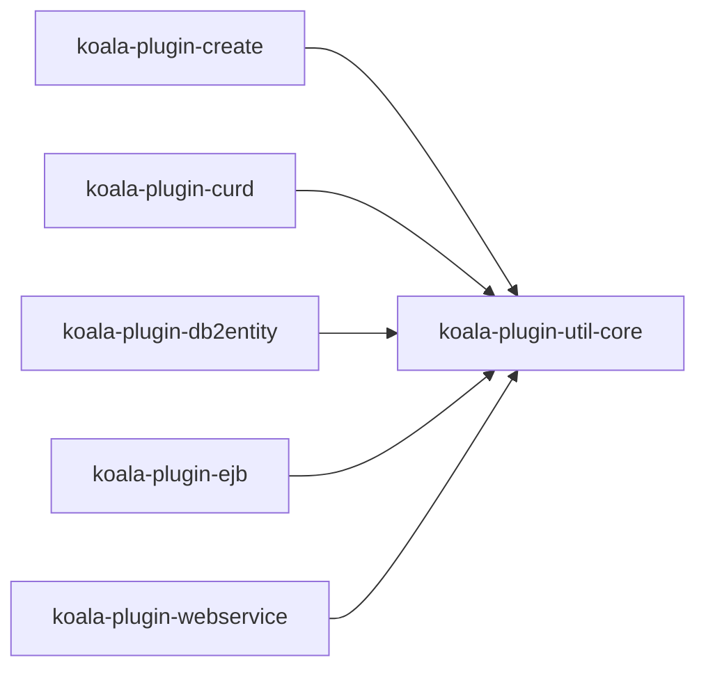
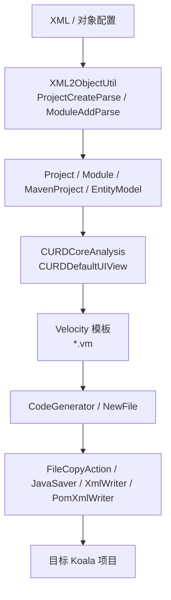
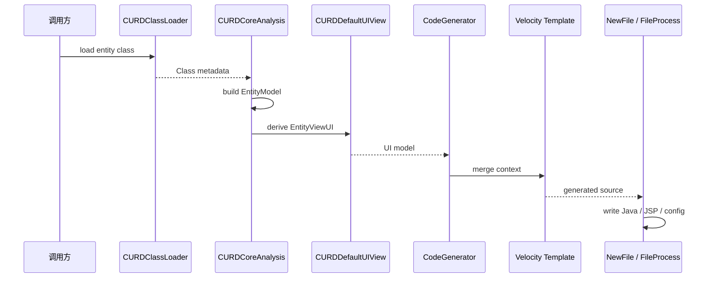
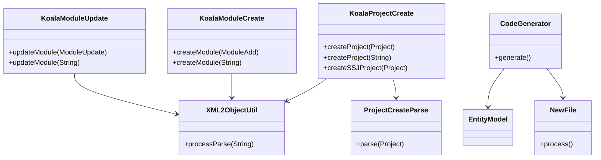

# koala-plugin 设计文档

## 1. 文档范围

本文档说明 `koala-plugin` 代码生成与工程辅助模块的模块边界、架构设计、生成流程、Mermaid UML、使用方式和维护注意事项。该模块主要供 Eclipse 插件、工程脚手架和代码生成器调用，不提供独立 Web 服务。

## 2. 模块定位

`koala-plugin` 是 Koala 的工程生成工具集，负责按照 XML、模板和现有源码模型生成或修改项目结构。

核心能力包括：

- 创建 Koala 标准项目和模块。
- 根据实体模型生成 CRUD 分层代码和 JSP 页面。
- 从数据库表生成实体类。
- 生成 EJB 和 WebService 相关部署代码。
- 提供 XML、POM、Velocity、文件复制、Maven 调用等基础工具。

## 3. 工程结构

```text
koala-plugin/
├── koala-plugin-util-core/  # XML/POM/Velocity/文件/Maven/项目解析工具
├── koala-plugin-create/     # 项目创建、模块新增、模块更新
├── koala-plugin-curd/       # CRUD 代码生成，历史拼写为 curd
├── koala-plugin-db2entity/  # 数据库表到 Entity 代码生成
├── koala-plugin-ejb/        # EJB 接口、实现和 Spring 配置生成
├── koala-plugin-webservice/ # SOAP/REST WebService 代码和配置生成
└── pom.xml                  # Maven 聚合工程
```

模块依赖方向：



## 4. 总体架构

生成器整体采用“配置输入 + 模型解析 + 模板渲染 + 文件/配置修改”的模式：



## 5. 核心模块设计

### 5.1 util-core

`koala-plugin-util-core` 是所有生成器的底座，主要组件包括：

- `MavenProject`、`Plugin`、`Dependency`、`ModuleType`：工程结构模型。
- `PomXmlReader`、`PomXmlWriter`、`WebXmlUtil`、`XmlReader`、`XmlWriter`：POM/Web XML 修改。
- `VelocityUtil`、`VelocityHelper`：模板渲染。
- `FileCopyAction`、`FileOperator`、`JavaSaver`：文件复制和源码保存。
- `PackageScanUtil`、`XML2ObjectUtil`：类扫描和 XML 到对象解析。
- `MavenExcuter`：调用 Maven 命令，历史类名拼写为 `Excuter`。

### 5.2 create

`koala-plugin-create` 提供项目和模块级生成入口：

- `KoalaProjectCreate#createProject()`：从 `Project` 对象或 XML 创建项目。
- `KoalaModuleCreate#createModule()`：向已有项目添加模块。
- `KoalaModuleUpdate#updateModule()`：更新已有模块配置。
- `ProjectCreateParse`、`ModuleAddParse`、`ModuleUpdateParse`：执行实际解析和生成。

### 5.3 curd

`koala-plugin-curd` 根据实体生成 CRUD 代码。注意模块名沿用了历史拼写 `curd`，语义是 CRUD。

主要流程：

1. `CURDClassLoader` 加载目标项目实体类。
2. `CURDCoreAnalysis` 分析实体字段、主键、版本字段和关联关系。
3. `CURDDefaultUIView` 推导列表、表单、详情和查询 UI 模型。
4. `CodeGenerator` 创建 `VelocityContext`。
5. 各类 `NewFile` 使用模板生成 Application、Facade、DTO、Assembler、Controller、Action 和 JSP。
6. `CURDConfigUpdate` 更新 Spring、POM 或 Web 配置。



### 5.4 db2entity、ejb、webservice

- `koala-plugin-db2entity`：读取数据库表和字段，使用 `EntityGenerateUtil` 与 `*.vm` 生成实体。
- `koala-plugin-ejb`：根据 Application 接口生成 Local/Remote 接口、实现和 Spring EJB 配置。
- `koala-plugin-webservice`：根据接口和方法模型生成 REST/SOAP WebService 部署文件、客户端和安全配置。

## 6. 类关系概览



## 7. 构建与使用

编译插件模块：

```bash
mvn -pl koala-plugin -am -DskipTests compile
```

安装到本地仓库，供其他模块或外部工具调用：

```bash
mvn -pl koala-plugin -am -DskipTests install
```

`koala-plugin` 没有 Jetty/Tomcat 启动入口。常见调用方式是在 Java 代码或 Eclipse 插件中实例化入口类：

```java
new KoalaProjectCreate().createProject("project.xml");
new KoalaModuleCreate().createModule("project-add.xml");
new KoalaModuleUpdate().updateModule("project-update.xml");
```

## 8. 维护注意事项

- 模板文件位于 `src/main/resources/templates` 或 `src/main/resources/vm`，修改模板后应生成一个示例项目检查编译。
- XML/POM 修改应继续使用 DOM/XPath 工具，避免字符串拼接破坏格式。
- 生成器会直接写目标项目文件，调用前应确认目标路径正确并有版本控制保护。
- 历史拼写如 `curd`、`MavenExcuter` 已被外部代码引用，不建议为了命名美观直接重命名。
