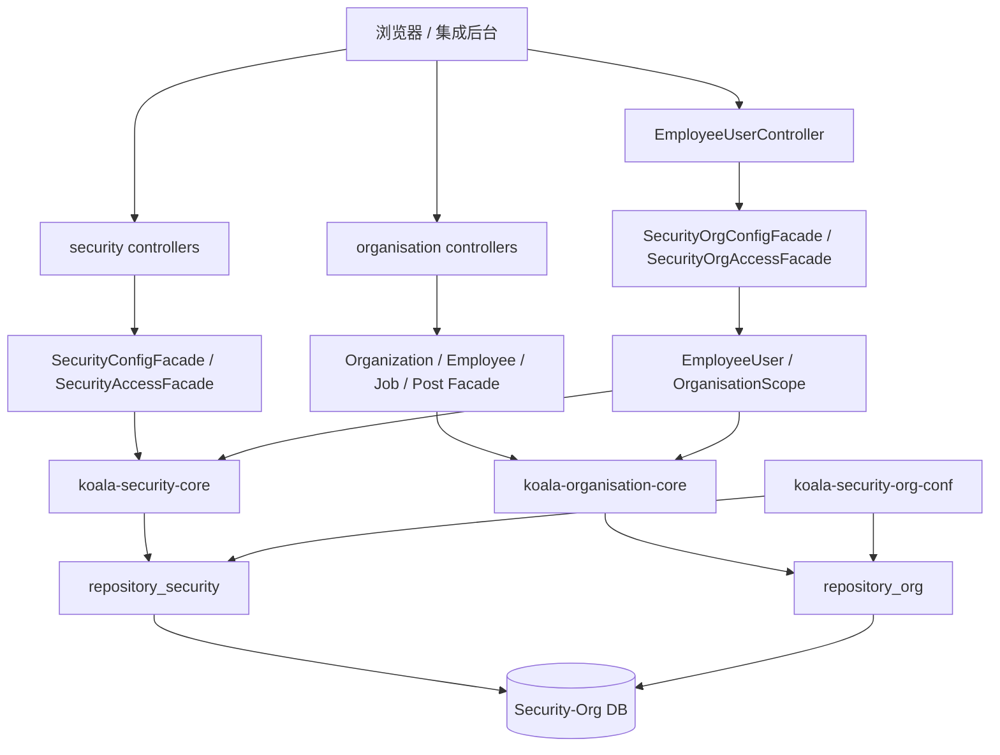
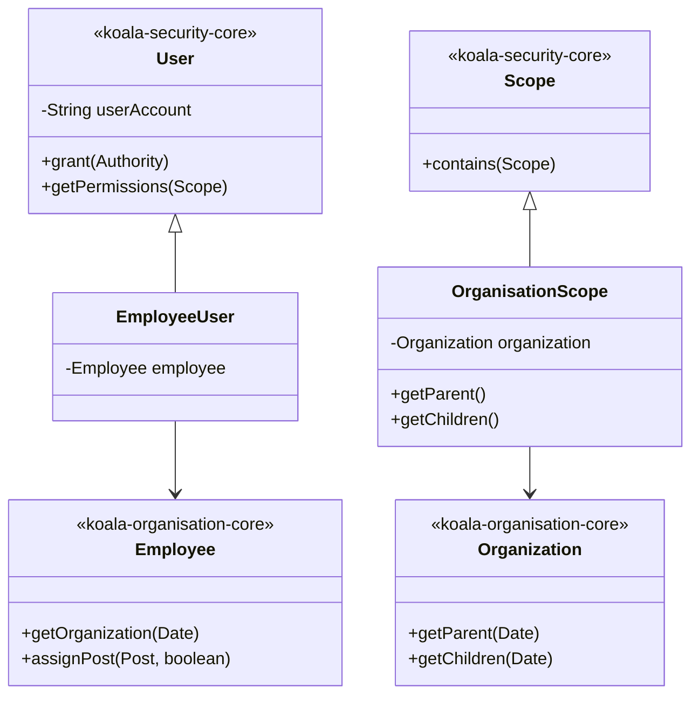
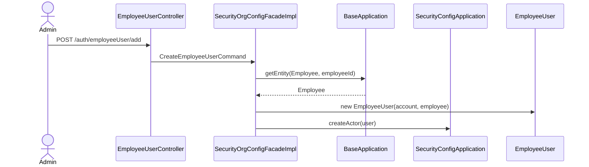
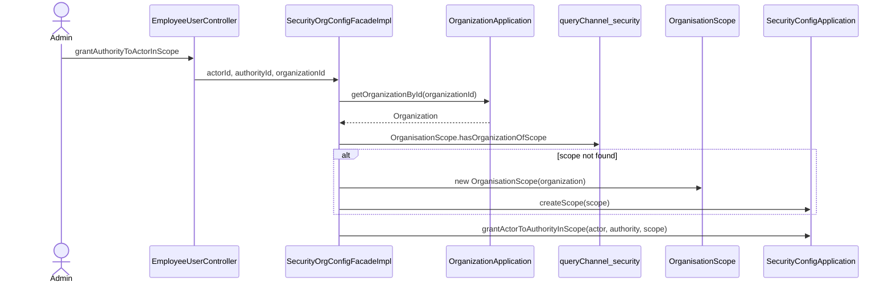

# koala-security-org 设计文档

## 1. 文档范围

本文档说明 `koala-security-org` 集成子系统的聚合模块设计、架构关系、组织授权模型、Web/API 入口、持久化配置和 Mermaid UML。领域桥接类细节见 `koala-security-org-core/DESIGN.md`。

## 2. 子系统定位

`koala-security-org` 连接 `koala-security` 与 `koala-organisation`，提供员工用户、组织范围授权和集成后台页面。它不是新的权限内核，而是把安全主体、角色权限、组织机构和员工信息放入同一运行上下文。

典型场景：

- 为员工创建登录账号。
- 给员工用户授予角色或权限。
- 授权时限定组织范围，例如“在某部门及其子部门内拥有某角色”。
- 在同一 Web 后台维护用户、角色、权限、组织、岗位、员工。

## 3. 工程结构

```text
koala-security-org/
├── koala-security-org-conf/          # 集成 Spring、共享 JPA、repository_security/repository_org
├── koala-security-org-core/          # EmployeeUser、OrganisationScope
├── koala-security-org-facade/        # 组织安全 Facade 接口和 Command
├── koala-security-org-facade-impl/   # 组织安全 Facade 实现和初始化配置
└── koala-security-org-web/           # 集成 WAR、Controller、JSP、JS、Filter
```

## 4. 架构设计

`koala-security-org-web` 同时引入安全、组织和集成 Facade。持久化层使用同一个 `entityManagerFactory_security_org`，但保留两个 repository bean 名称，便于复用原有领域对象中的 Active Record 仓储查找逻辑。



## 5. 核心模型

集成层只新增两个领域对象：

- `EmployeeUser extends User`：安全用户与组织员工的一对一关联。
- `OrganisationScope extends Scope`：组织机构授权范围。



## 6. 主要业务流程

### 6.1 创建员工用户



### 6.2 在组织范围内授权



## 7. Web/API 入口

`koala-security-org-web` 包含安全和组织两个后台的页面资源，并额外提供员工用户控制器：

- `/auth/employeeUser/add`、`/update`：维护员工用户。
- `/auth/employeeUser/pagingQuery`：分页查询员工用户。
- `/auth/employeeUser/pagingQueryGrantRoleByUserId`：查询已授予角色。
- `/auth/employeeUser/pagingQueryGrantPermissionByUserId`：查询已授予权限。
- `/auth/employeeUser/grantAuthorityToActorInScope`：按组织范围授权。
- `/auth/employeeUser/terminateUserFromRoleInScope`：撤销范围内角色。
- `/auth/employeeUser/terminateUserFromPermissionInScope`：撤销范围内权限。

组织接口沿用 `koala-organisation-controller` 的 `/organization`、`/job`、`/post`、`/employee`；权限接口沿用 `koala-security-controller` 的 `/auth/user`、`/auth/role`、`/auth/permission`、`/auth/menu`、`/auth/url`、`/auth/page`。

## 8. 持久化与启动

`koala-security-org-conf` 的独立持久化配置会同时扫描：

- `org.openkoala.security.core.domain`
- `org.openkoala.organisation.core.domain`
- `org.openkoala.security.org.core.domain`

它将 `repository_security` 和 `repository_org` 指向同一个集成持久化单元，确保安全授权和组织对象能在同一事务中使用。

启动命令：

```bash
mvn -pl koala-security-org/koala-security-org-web -am jetty:run
```

当前 Web POM 固定端口为 `8090`，默认访问地址为：

```text
http://localhost:8090/
```

## 9. 集成边界

- 本模块适合替代分别启动 `koala-security-web` 和 `koala-organisation-web` 的本地集成后台。
- 基础安全能力仍来自 `koala-security`，组织能力仍来自 `koala-organisation`。
- 如果接口如 `/job/pagingquery.koala` 报错，优先检查集成持久化配置、初始化数据和组织表结构，而不是只看 `koala-security-org-core`。
