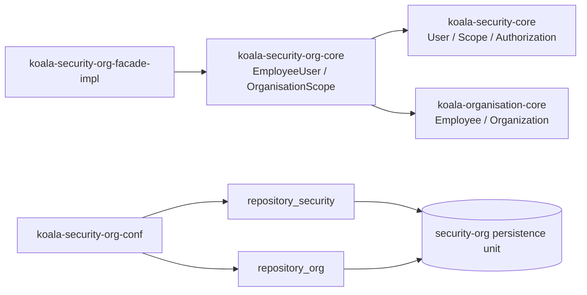
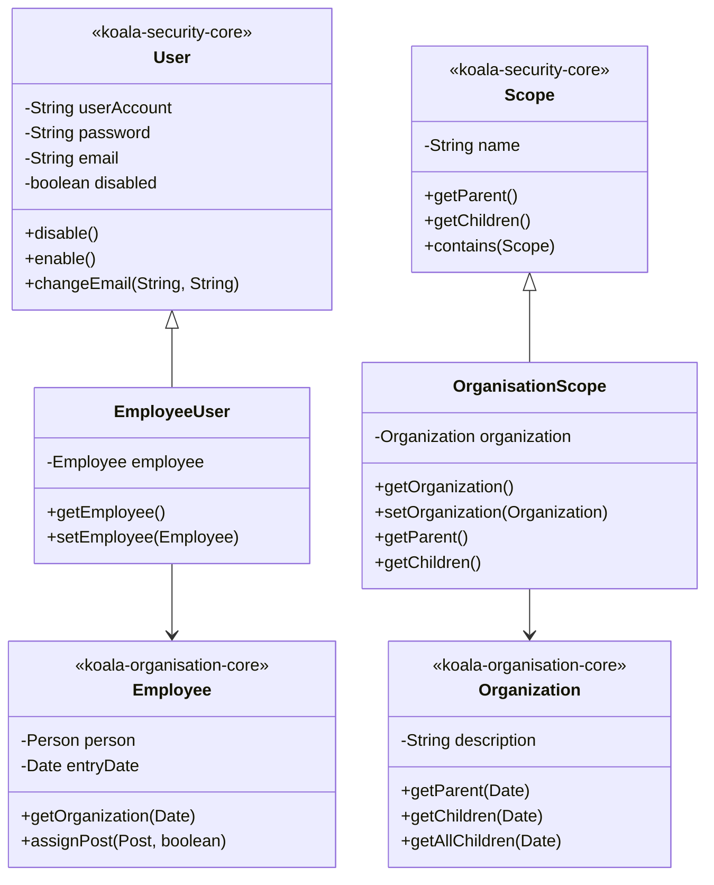
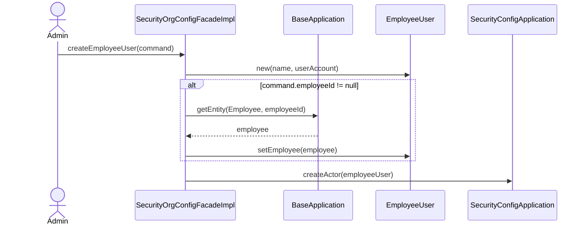
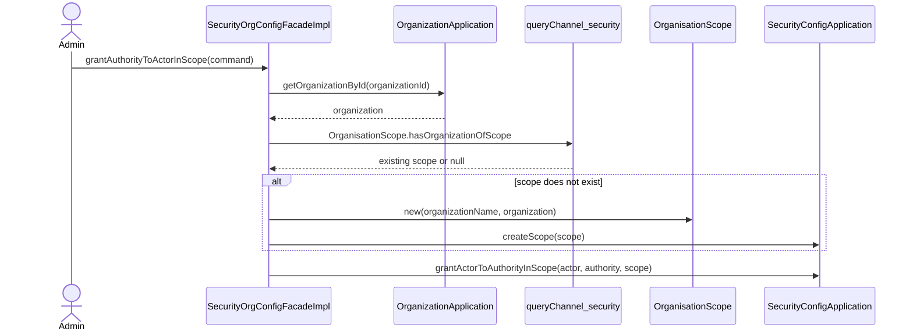

# koala-security-org-core 设计文档

## 1. 文档范围

本文档描述 `koala-security-org-core` 的领域设计、架构边界、核心对象、持久化映射、主要集成流程和 Mermaid UML。该模块不是独立权限核心，而是把 `koala-security-core` 与 `koala-organisation-core` 连接起来的组织权限扩展层。

模块路径：

```text
koala-security-org/koala-security-org-core
```

## 2. 模块定位

`koala-security-org-core` 只有两个领域扩展类：

- `EmployeeUser`：员工用户，继承 `koala-security-core` 的 `User`，并关联 `koala-organisation-core` 的 `Employee`。
- `OrganisationScope`：组织机构授权范围，继承 `koala-security-core` 的 `Scope`，并关联 `koala-organisation-core` 的 `Organization`。

它的目标是让权限子系统不直接依赖组织业务实现，同时又能在集成层表达“某个员工用户在某个组织范围内拥有某项角色或权限”。

## 3. 架构设计

### 3.1 集成边界

`koala-security-core` 管理用户、角色、权限和授权范围抽象；`koala-organisation-core` 管理员工和组织机构；`koala-security-org-core` 只提供两者的桥接实体。



### 3.2 运行时配置

运行时配置来自 `koala-security-org-conf`：

- `security-org-root.xml` 导入基础上下文和独立持久化配置。
- `security-org-standalone-persistence.xml` 同时扫描：
  - `org.openkoala.security.core.domain`
  - `org.openkoala.organisation.core.domain`
  - `org.openkoala.security.org.core.domain`
- `repository_security` 和 `repository_org` 指向同一个 `entityManager_security_org`。
- `transactionManager_security` 和 `transactionManager_org` 使用同一个 `entityManagerFactory_security_org`。

这意味着 security 与 organisation 的实体在该集成场景中共享同一个持久化单元。

## 4. 代码结构

```text
src/main/java/org/openkoala/security/org/core/domain
├── EmployeeUser.java       # 员工用户，User + Employee
└── OrganisationScope.java  # 组织授权范围，Scope + Organization
```

该模块当前没有 `src/test/java`。相关集成行为主要在 `koala-security-org-facade-impl` 的测试中覆盖。

## 5. 核心领域模型

### 5.1 EmployeeUser

`EmployeeUser` 继承 `User`，因此具备 `User` 的全部认证和授权能力，包括账号、密码、邮箱、电话、启停、角色/权限授权等。

它额外通过 `@OneToOne` 关联组织模块的 `Employee`：

```text
EmployeeUser --one-to-one--> Employee
```

设计含义：

- 可以存在非员工用户，即普通 `User`。
- 可以存在非用户员工，即普通 `Employee`。
- 当一个员工需要登录系统时，用 `EmployeeUser` 表示二者的结合。

### 5.2 OrganisationScope

`OrganisationScope` 继承 `Scope`，表示以组织机构为边界的数据权限范围。

它通过 `@OneToOne` 关联 `Organization`：

```text
OrganisationScope --one-to-one--> Organization
```

命名查询：

```text
OrganisationScope.hasOrganizationOfScope
```

该查询用于根据 `Organization` 查找已有的组织范围，避免重复创建同一个机构范围。

## 6. UML 类图



## 7. 授权集成流程

### 7.1 创建员工用户



### 7.2 在组织范围内授权



## 8. 持久化设计

`EmployeeUser` 继承 `User`，而 `User` 继承 `Actor`。因此 `EmployeeUser` 使用 `Actor` 继承树的单表映射：

| 类型 | 映射来源 | 表/鉴别值 |
| --- | --- | --- |
| `EmployeeUser` | `Actor` / `User` | `KS_ACTORS`，`CATEGORY = EMPLOYEE_USER` |
| `OrganisationScope` | `Scope` | `KS_SCOPES`，`CATEGORY = ORGANIZATION_SCOPE` |
| `EmployeeUser.employee` | organisation core | `EMPLOYEE_ID` 外键指向员工实体 |
| `OrganisationScope.organization` | organisation core | `ORGANIZATION_ID` 外键指向组织实体 |

由于 `security-org-standalone-persistence.xml` 同时扫描 security、organisation、security-org 三套领域包，这两个扩展实体可以直接引用两边的 JPA 实体。

## 9. 领域规则与约束

| 规则 | 触发位置 | 说明 |
| --- | --- | --- |
| 员工用户账号唯一 | `EmployeeUser` 继承 `User` | 沿用 `UserAccountIsExistedException` |
| 员工用户密码、邮箱、电话规则 | `EmployeeUser` 继承 `User` | 沿用 `User` 的变更和校验逻辑 |
| 员工关联可为空 | `EmployeeUser.setEmployee()` | 支持非员工用户，也支持后续再绑定员工 |
| 组织范围按 Organization 复用 | `OrganisationScope.hasOrganizationOfScope` | Facade 创建授权范围前会先查询是否已有 Scope |
| Scope 父子关系未实现 | `OrganisationScope.getParent()` / `getChildren()` | 当前都返回 `null`，只适合简单组织范围绑定 |

## 10. 测试与验证

core 模块当前没有独立测试目录。相关集成测试位于：

```text
koala-security-org/koala-security-org-facade-impl/src/test/java/org/openkoala/security/org/facade/impl
```

主要覆盖：

- `SecurityOrgAccessFacadeTest`：创建 `EmployeeUser` 并分页查询员工用户。
- `UserTest`：在 security-org 集成持久化环境下保存普通 `User`。

常用命令：

```bash
mvn -pl koala-security-org/koala-security-org-core test
mvn -pl koala-security-org/koala-security-org-facade-impl -Dtest=SecurityOrgAccessFacadeTest test
```

## 11. 扩展建议

如果需要完整组织范围树，建议让 `OrganisationScope.getParent()` 和 `getChildren()` 委托 `Organization.getParent(Date)`、`Organization.getChildren(Date)`，并返回对应的 `OrganisationScope`。否则 `Scope.contains()` 在比较不同组织范围时可能无法正确工作。

如果未来还有其他业务主体需要登录，例如客户、供应商、外部合作方，应优先沿用 `User` 的继承扩展方式，新增类似 `CustomerUser` 的桥接类型，而不是把业务字段直接塞进 `User`。

## 12. 已知设计注意点

- `OrganisationScope.businessKeys()` 当前返回空数组，按 `SecurityAbstractEntity.equals()` 逻辑，两个 `OrganisationScope` 不会基于组织或名称自然相等。
- `OrganisationScope.getParent()` 和 `getChildren()` 当前返回 `null`，调用 `Scope.contains()` 时需要谨慎。
- `security-org-standalone-persistence.xml` 中 `repository_security` 和 `repository_org` 指向同一个 `entityManager_security_org`，这是集成模块能同时保存 security 和 organisation 实体的关键。
- 该模块没有直接测试，行为主要依赖 facade-impl 集成测试覆盖。
