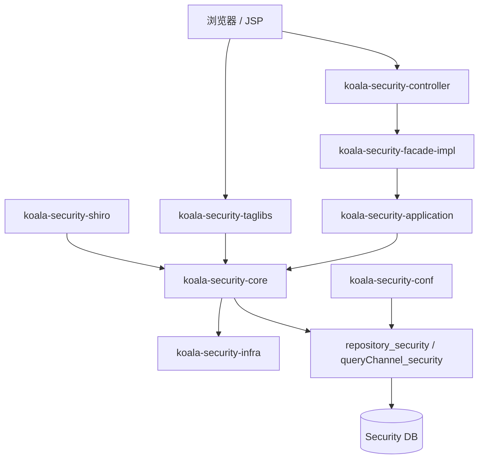
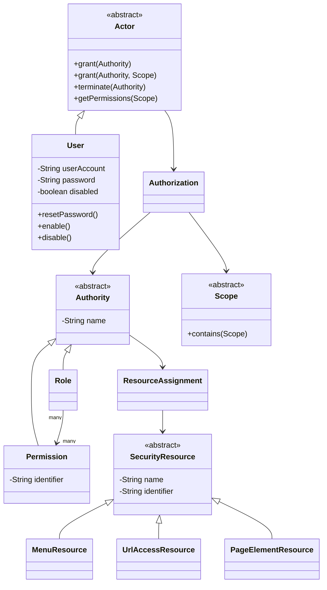
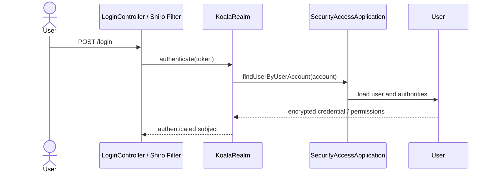

# koala-security 设计文档

## 1. 文档范围

本文档说明 `koala-security` 权限子系统的聚合模块设计、分层架构、运行链路、Web/API 入口、持久化配置和 Mermaid UML。领域核心的细节见 `koala-security-core/DESIGN.md`。

## 2. 子系统定位

`koala-security` 负责统一认证与授权能力，包括用户、角色、权限、菜单资源、URL 资源、页面元素资源、授权关系、Shiro 登录集成和 JSP 标签权限控制。它可以单独作为权限管理后台运行，也可以被 `koala-security-org`、`koala-bpm` 等业务子系统复用。

## 3. 工程结构

```text
koala-security/
├── koala-security-conf/          # Spring 根配置、JPA、数据源、Shiro 配置
├── koala-security-core/          # 权限领域模型：Actor、User、Role、Permission、Resource、Scope
├── koala-security-infra/         # 基础设施实现，例如 MD5EncryptService
├── koala-security-application/   # 应用服务和系统初始化 XML 解析
├── koala-security-facade/        # Facade 接口、Command、DTO
├── koala-security-facade-impl/   # Facade 实现、Assembler、分页查询
├── koala-security-controller/    # Spring MVC Controller
├── koala-security-shiro/         # Shiro Realm、Filter、权限判断适配
├── koala-security-taglibs/       # JSP 权限标签
└── koala-security-web/           # WAR、JSP、JS、CSS、web.xml
```

## 4. 架构设计

系统采用 Web -> Controller -> Facade -> Application -> Domain -> Repository 的分层结构。领域对象使用 Active Record 风格，通过 `repository_security` 访问 JPA。



## 5. 核心模型

核心模型分为三组：

- 授权主体：`Actor`、`User`，表示可被授权的人或系统账号。
- 授权对象：`Authority`、`Role`、`Permission`，角色可以包含权限。
- 资源对象：`SecurityResource`、`MenuResource`、`UrlAccessResource`、`PageElementResource`。

授权关系由 `Authorization` 表达，资源分配由 `ResourceAssignment` 表达。范围授权通过抽象 `Scope` 支持，组织范围由 `koala-security-org-core` 的 `OrganisationScope` 实现。



## 6. 主要业务流程

### 6.1 登录认证



### 6.2 给用户授予角色或权限

```mermaid
sequenceDiagram
    actor Admin
    participant Controller as UserController
    participant Facade as SecurityConfigFacadeImpl
    participant App as SecurityConfigApplication
    participant Actor
    participant Authority

    Admin->>Controller: grantRoleToUser / grantPermissionToUser
    Controller->>Facade: command
    Facade->>App: get actor and authority
    App->>Actor: grant(authority)
    Actor->>Authority: create Authorization
```

## 7. Web/API 入口

主要 Controller 路径：

- `/auth/user`：用户新增、启停、重置密码、角色/权限授权。
- `/auth/role`：角色维护、授权菜单、URL、页面元素、权限。
- `/auth/permission`：权限维护。
- `/auth/menu`、`/auth/url`、`/auth/page`：资源维护和资源到权限的绑定。
- `/auth/currentUser`：当前用户资料、切换角色、菜单查询。
- `/login`、`/logout`：认证入口。

Web 资源位于 `koala-security-web/src/main/webapp/pages/auth`，前端脚本位于 `koala-security-web/src/main/webapp/js/security`。

## 8. 持久化与启动

`koala-security-conf` 提供独立持久化配置：

- `security-root.xml`：导入基础上下文、持久化和扩展配置。
- `security-standalone-persistence.xml`：配置 `repository_security`、`queryChannel_security`、事务管理器和实体扫描。
- `database.properties`：本地默认数据源配置。

启动命令：

```bash
mvn -pl koala-security/koala-security-web -am jetty:run
```

当前 Web POM 固定 Jetty 端口为 `8070`，默认访问地址为：

```text
http://localhost:8070/
```

## 9. 集成关系

- `koala-security-org` 复用 `User`、`Scope`、`Authorization`，扩展员工用户和组织范围授权。
- `koala-bpm`、`koala-opencis` 等业务系统可通过 Shiro、Facade 或 JSP 标签集成权限控制。
- `koala-security-taglibs` 用于 JSP 页面按权限隐藏或展示按钮、菜单等元素。
