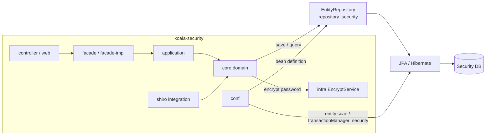
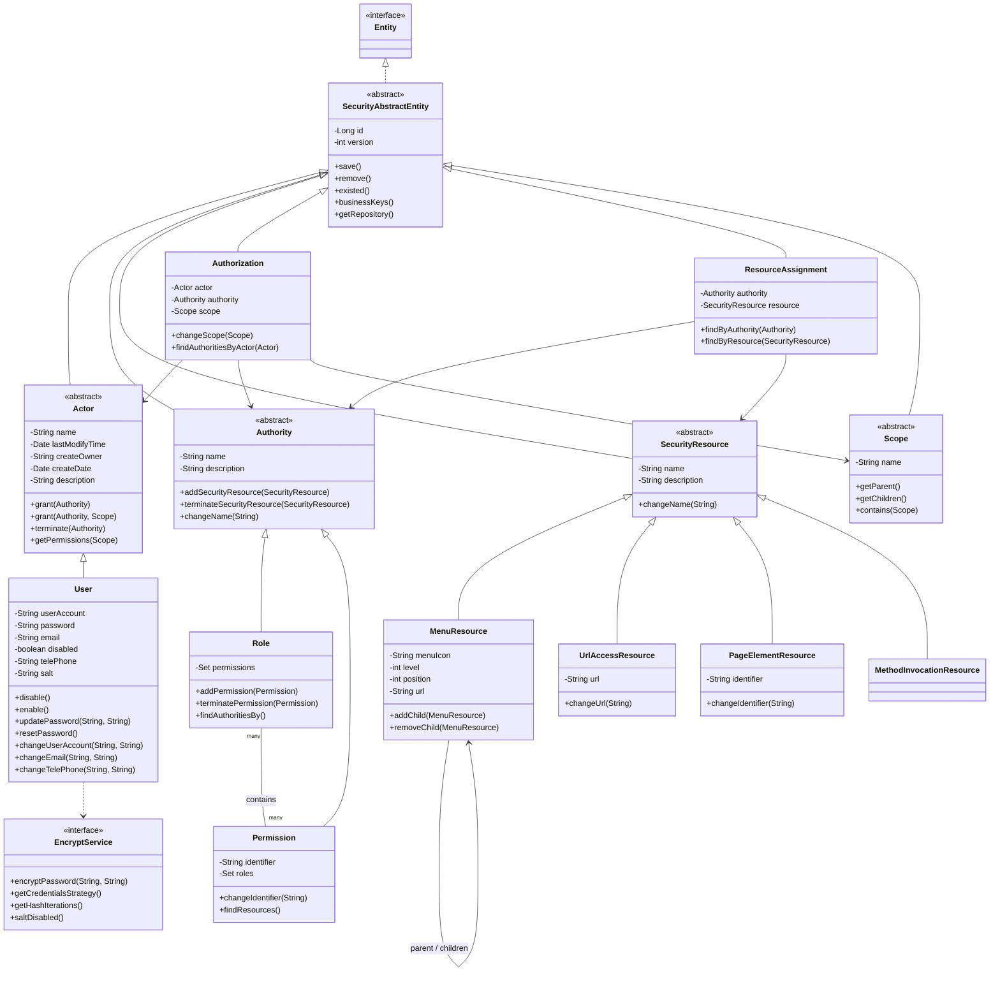
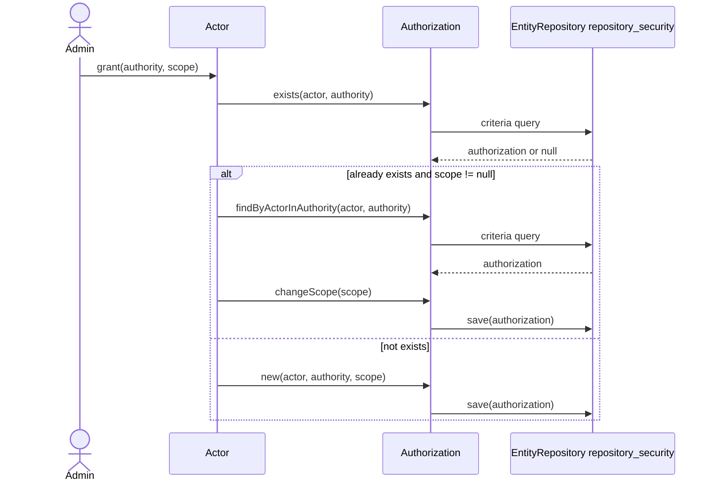
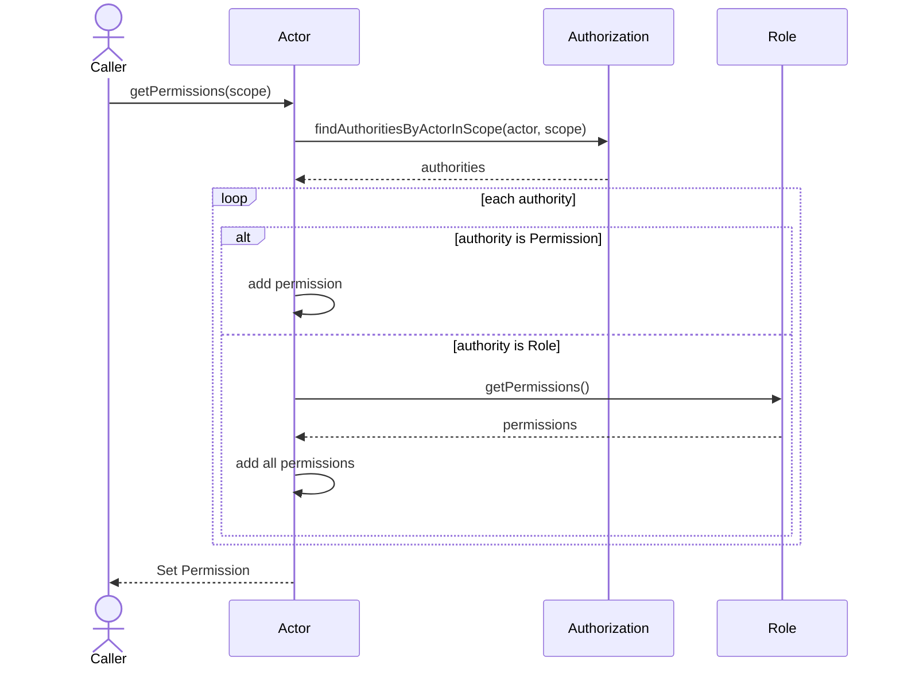
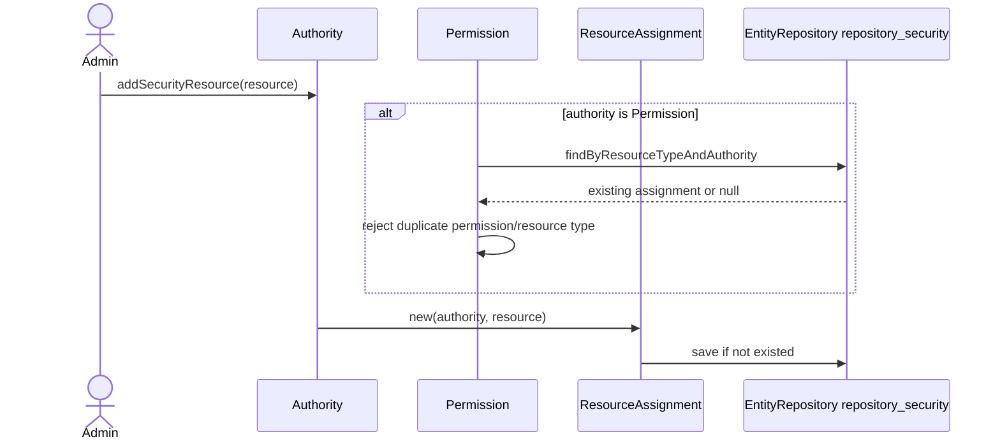

# koala-security-core 设计文档

## 1. 文档范围

本文档描述 `koala-security-core` 的领域设计、架构边界、核心对象、持久化映射、主要业务流程和 Mermaid UML。该模块是 Koala 权限子系统的领域核心，负责用户、角色、权限、权限资源、授权关系、资源分配和授权范围。

模块路径：

```text
koala-security/koala-security-core
```

## 2. 模块定位

`koala-security-core` 只包含领域实体、领域异常和密码加密接口，不包含 Controller、Facade、Application Service 或具体加密实现。上层模块通过 application/facade 调用这里的领域对象完成权限配置和权限查询。

在 `koala-security` 子系统中，它的位置如下：

```text
koala-security
├── koala-security-conf          # Spring、JPA、repository_security、事务配置
├── koala-security-core          # 本文档描述的权限领域核心
├── koala-security-application   # 应用服务层
├── koala-security-facade        # 对外接口与命令/DTO
├── koala-security-facade-impl   # Facade 实现
├── koala-security-controller    # 控制层
├── koala-security-web           # JSP 与静态资源
├── koala-security-infra         # EncryptService 实现等基础设施
└── koala-security-shiro         # Shiro Realm 与认证集成
```

## 3. 架构设计

### 3.1 架构风格

该模块采用 DDD 风格建模，但实现方式是 Active Record：领域实体继承 `SecurityAbstractEntity` 后，直接通过静态 `EntityRepository` 执行 `save()`、`remove()`、命名查询和条件查询。

核心特点：

- 领域规则写在实体方法中，例如 `User.changeEmail()`、`Actor.grant()`、`Permission.addSecurityResource()`。
- 权限模型以 `Actor`、`Authority`、`SecurityResource` 三条继承树为主体。
- `Authorization` 表示“谁拥有哪个授权，可以限定在哪个 Scope 内”。
- `ResourceAssignment` 表示“某个授权关联了哪些权限资源”。
- 持久化仓储通过 `InstanceFactory.getInstance(EntityRepository.class, "repository_security")` 获取。
- 具体密码加密由外部 `EncryptService` 实现提供，例如 `koala-security-infra` 中的 `MD5EncryptService`。

### 3.2 组件视图



## 4. 代码结构

```text
src/main/java/org/openkoala/security/core
├── SecurityException.java                  # 领域异常基类
├── *Exception.java                         # 具体领域约束异常
└── domain
    ├── SecurityAbstractEntity.java         # 实体基类，封装 ID、version、repository
    ├── Actor.java / User.java              # 授权参与者与用户
    ├── Authority.java                      # 授权抽象
    ├── Role.java / Permission.java         # 角色与权限
    ├── SecurityResource.java               # 权限资源抽象
    ├── MenuResource.java                   # 菜单资源
    ├── UrlAccessResource.java              # URL 资源
    ├── PageElementResource.java            # 页面元素资源
    ├── MethodInvocationResource.java       # 方法调用资源占位
    ├── Authorization.java                  # Actor 与 Authority 的授权关系
    ├── ResourceAssignment.java             # Authority 与 SecurityResource 的绑定关系
    ├── Scope.java                          # 授权范围抽象
    └── EncryptService.java                 # 密码加密服务接口
```

## 5. 核心领域模型

### 5.1 基础实体

`SecurityAbstractEntity` 是所有持久化实体的基类，提供：

- `id`：数据库主键。
- `version`：JPA 乐观锁字段。
- `save()`、`remove()`：Active Record 风格持久化方法。
- `get()`、`load()`、`findAll()`：静态查询入口。
- `businessKeys()`：业务主键定义，用于 `equals()` 和 `hashCode()`。

所有实体都依赖 `repository_security`，该 Bean 由 `koala-security-conf` 配置。

### 5.2 Actor 与 User

`Actor` 是授权参与者抽象，表示可以被授予角色或权限的主体。当前 core 中的具体子类是 `User`，集成模块还会扩展出 `EmployeeUser`。

`Actor` 的主要职责：

- `grant(Authority)`：授予角色或权限。
- `grant(Authority, Scope)`：在指定范围内授权。
- `terminate(Authority)`：撤销授权。
- `terminateAuthorityInScope(Authority, Scope)`：撤销指定范围内授权。
- `getPermissions(Scope)`：解析 Actor 在某个范围内拥有的权限集合。
- `remove()`：删除 Actor 时级联删除相关 `Authorization`。

`User` 表示可登录系统的用户，负责账号、密码、邮箱、电话和启停状态。默认初始密码是 `888888`，密码使用 `EncryptService` 按 `salt + userAccount` 加密。

### 5.3 Authority、Role 与 Permission

`Authority` 是可被授予 Actor 的抽象授权。它有两个具体子类：

- `Role`：粗粒度授权，是一组 `Permission` 的集合。
- `Permission`：细粒度授权，通常对应一项操作或责任。

`Role` 和 `Permission` 是双向多对多关系，通过 `KS_ROLE_PERMISSION_MAP` 持久化。`Role.findAuthoritiesBy()` 会返回角色自身和其全部权限。

`Permission` 额外包含 `identifier`，例如 `user:create`。权限可以绑定资源，但 `Permission.addSecurityResource()` 会限制重复绑定，避免同一类资源或同一权限重复分配。

### 5.4 SecurityResource 体系

`SecurityResource` 表示纳入权限控制的系统资源。当前子类包括：

- `MenuResource`：菜单入口，支持父子菜单树、层级和排序。
- `UrlAccessResource`：服务端 URL 访问资源。
- `PageElementResource`：页面元素资源，例如按钮、标题等。
- `MethodInvocationResource`：方法调用资源，占位类，当前未实现具体字段。

资源与授权之间通过 `ResourceAssignment` 关联。资源被分配后不能直接删除。

### 5.5 Authorization 与 ResourceAssignment

`Authorization` 是授权中心，表达：

```text
Actor --拥有--> Authority --限定于--> Scope
```

`scope` 可以为空，表示不限定范围。保存时如果相同 `actor + authority + scope` 已存在，则直接返回。

`ResourceAssignment` 表达：

```text
Authority --关联--> SecurityResource
```

当 Authority 是 Role 时，查询资源会同时展开 Role 直接绑定的资源和 Role 所含 Permission 绑定的资源。

### 5.6 Scope

`Scope` 表示授权范围，例如组织机构范围。core 只定义抽象父类，不提供具体实现。它要求子类实现：

- `getParent()`
- `getChildren()`

`contains(Scope)` 用于判断一个授权范围是否覆盖另一个范围。`koala-security-org-core` 中的 `OrganisationScope` 是该抽象的组织机构实现。

## 6. UML 类图



## 7. 关键业务流程

### 7.1 授予 Actor 角色或权限



### 7.2 查询 Actor 在范围内的权限



### 7.3 为授权绑定资源



## 8. 持久化设计

### 8.1 仓储与事务

运行时配置来自 `koala-security-conf`：

- `security-root.xml` 导入基础上下文和独立 JPA 配置。
- `security-standalone-persistence.xml` 扫描 `org.openkoala.security.core.domain`。
- `repository_security` 使用 `KoalaEntityRepositoryJpa`。
- `queryChannel_security` 使用 `QueryChannelServiceImpl`。
- `transactionManager_security` 使用 `JpaTransactionManager`。

测试基类 `AbstractDomainIntegrationTestCase` 使用：

```text
@ContextConfiguration("classpath*:META-INF/spring/security-root.xml")
@TransactionConfiguration(transactionManager = "transactionManager_security", defaultRollback = true)
```

### 8.2 表和继承

| 模型 | 映射 | 说明 |
| --- | --- | --- |
| `Actor` 继承树 | `KS_ACTORS`，`CATEGORY` | 保存 `User` 及扩展参与者 |
| `Authority` 继承树 | `KS_AUTHORITIES`，`CATEGORY` | 保存 `Role`、`Permission` |
| `SecurityResource` 继承树 | `KS_SECURITYRESOURCES`，`CATEGORY` | 保存菜单、URL、页面元素、方法资源 |
| `Scope` 继承树 | `KS_SCOPES`，`CATEGORY` | 保存授权范围 |
| `Authorization` | `KS_AUTHORIZATIONS` | Actor 与 Authority 的授权关系 |
| `ResourceAssignment` | `KS_RESOURCEASSIGNMENTS` | Authority 与 SecurityResource 的绑定关系 |
| `Role` - `Permission` | `KS_ROLE_PERMISSION_MAP` | 角色和权限多对多 |
| 菜单父子关系 | `KS_MENU_RESOURCE_RELATION` | 菜单树关系 |

## 9. 领域规则与异常

| 规则 | 触发位置 | 异常 |
| --- | --- | --- |
| Actor 名称不能为空 | `Actor(String name)` | `IllegalArgumentException` |
| 用户账号不能为空且不能重复 | `User(String, String)` | `IllegalArgumentException`、`UserAccountIsExistedException` |
| 修改邮箱、电话前必须校验密码 | `User.changeEmail()`、`User.changeTelePhone()` | `UserPasswordException` |
| 邮箱、电话不能重复 | `User.changeEmail()`、`User.changeTelePhone()` | `EmailIsExistedException`、`TelePhoneIsExistedException` |
| Authority 名称不能为空且同类型不能重复 | `Authority(String)`、`changeName()` | `IllegalArgumentException`、`NameIsExistedException` |
| 已授权给 Actor 的 Authority 不能删除 | `Authority.remove()` | `CorrelationException` |
| Permission identifier 不能为空且不能重复 | `Permission(String, String)`、`changeIdentifier()` | `IllegalArgumentException`、`IdentifierIsExistedException` |
| Permission 已加入 Role 时不能删除 | `Permission.remove()` | `CorrelationException` |
| SecurityResource 名称不能为空且同类型不能重复 | `SecurityResource(String)`、`changeName()` | `IllegalArgumentException`、`NameIsExistedException` |
| UrlAccessResource URL 不能为空且不能重复 | `UrlAccessResource(String, String)`、`changeUrl()` | `IllegalArgumentException`、`UrlIsExistedException` |
| PageElementResource identifier 不能为空且不能重复 | `PageElementResource(String, String)`、`changeIdentifier()` | `IllegalArgumentException`、`IdentifierIsExistedException` |
| 已绑定 Authority 的资源不能删除 | `SecurityResource.remove()` | `CorrelationException` |
| 不存在的授权校验失败 | `Authorization.checkAuthorization()` | `AuthorizationIsNotExisted` |

## 10. 查询设计

主要命名查询：

- `User.loginByUserAccount`
- `User.count`
- `Authority.findAllAuthoritiesByUserAccount`
- `Authority.getAuthorityByName`
- `Authorization.findAuthoritiesByActor`
- `SecurityResource.findAllByType`
- `SecurityResource.findByName`
- `ResourceAssignment.findSecurityResourcesByAuthorities`
- `ResourceAssignment.findSecurityResourcesByAuthority`
- `ResourceAssignment.findSecurityResourcesByAuthorityNoResourcesType`
- `ResourceAssignment.findAuthoritiesBySecurityResource`
- `ResourceAssignment.checkHasSecurityResource`
- `ResourceAssignment.findByResourceTypeAndAuthority`

维护查询时需要注意 Role 的展开规则：查询某个 Role 可访问的资源时，结果应包含 Role 直接绑定的资源，也包含 Role 所含 Permission 绑定的资源。

## 11. 测试设计

测试位于：

```text
src/test/java/org/openkoala/security/core/domain
src/test/java/org/openkoala/security/core/util
```

主要测试类：

- `UserTest`：账号唯一、启停、按账号查询、角色/权限查询。
- `ActorTest`：授权、撤销、按 Scope 获取权限。
- `AuthorizationTest`：授权保存、查询、存在性校验。
- `RoleTest`：角色名称唯一、权限增删、角色删除约束。
- `PermissionTest`：权限标识唯一、资源查询、删除约束。
- `ResourceAssignmentTest`：资源分配保存、查询、Role 展开 Permission 资源。
- `MenuResourceTest`：菜单树、名称唯一、级联删除。
- `UrlAccessResourceTest`：URL 唯一、资源授权、删除约束。
- `PageElementResourceTest`：页面元素标识唯一、名称变更。
- `BigDataTest`：批量角色、权限、URL、菜单、页面元素保存。

常用命令：

```bash
mvn -pl koala-security/koala-security-core test
mvn -pl koala-security/koala-security-core -Dtest=AuthorizationTest test
```

## 12. 扩展建议

新增 Actor 类型时继承 `Actor`，增加 `@DiscriminatorValue`，并明确 `businessKeys()`。如果该 Actor 需要登录能力，优先评估是否继承 `User`。

新增资源类型时继承 `SecurityResource`，补充唯一性规则、查询方法和 `ResourceAssignment` 查询覆盖。需要页面控制的资源应考虑是否需要可检查的 `identifier`。

新增 Scope 类型时继承 `Scope`，必须实现父子范围语义，否则 `Scope.contains()` 可能无法正确判断授权覆盖关系。

## 13. 已知设计注意点

- 领域对象直接依赖静态 `repository_security`，单元测试通常需要 Spring/JPA 环境或显式替换 repository。
- `Authorization.businessKeys()` 只包含 `actor` 和 `authority`，但 `save()` 的重复判断包含 `scope`。维护 equals/hashCode 或集合行为时要注意这两者不完全一致。
- `Actor.grant(authority, scope)` 在已有无范围授权时会变更 Scope，而不是新建一条并存授权。
- `Permission.addSecurityResource()` 对同类型资源绑定有额外限制，和 `Authority.addSecurityResource()` 的普通绑定规则不同。
- `MethodInvocationResource` 目前只有类型定义，尚无方法签名、类名等字段。
